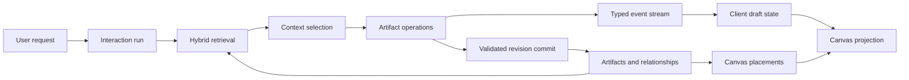
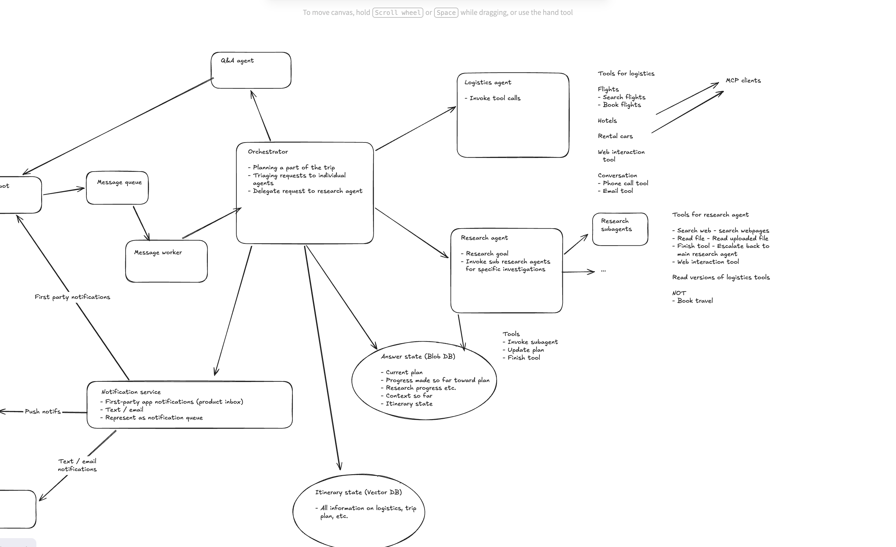
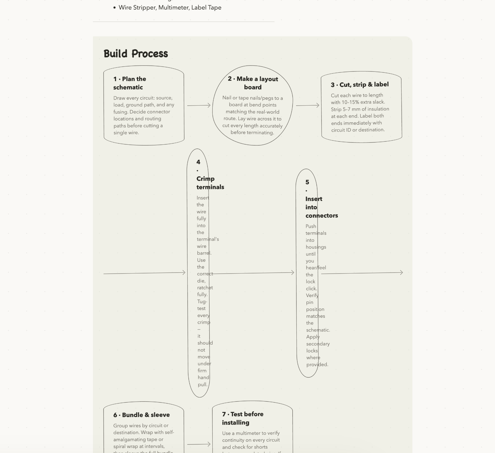
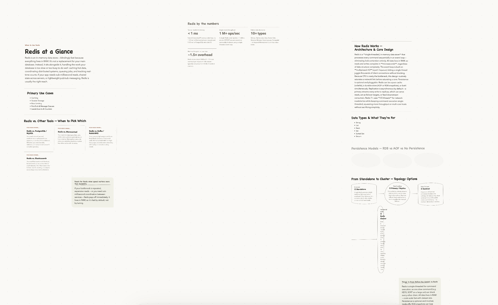
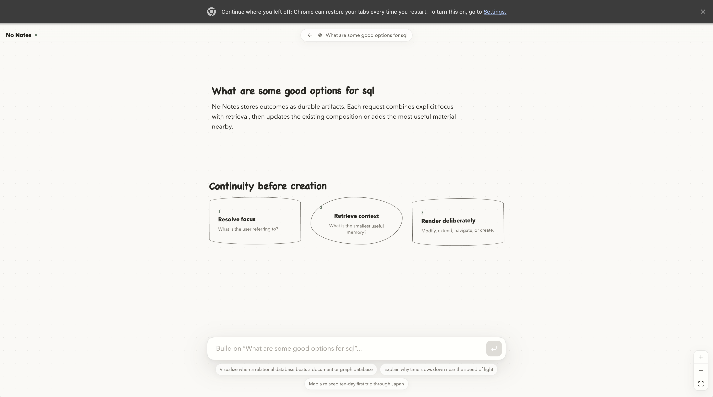
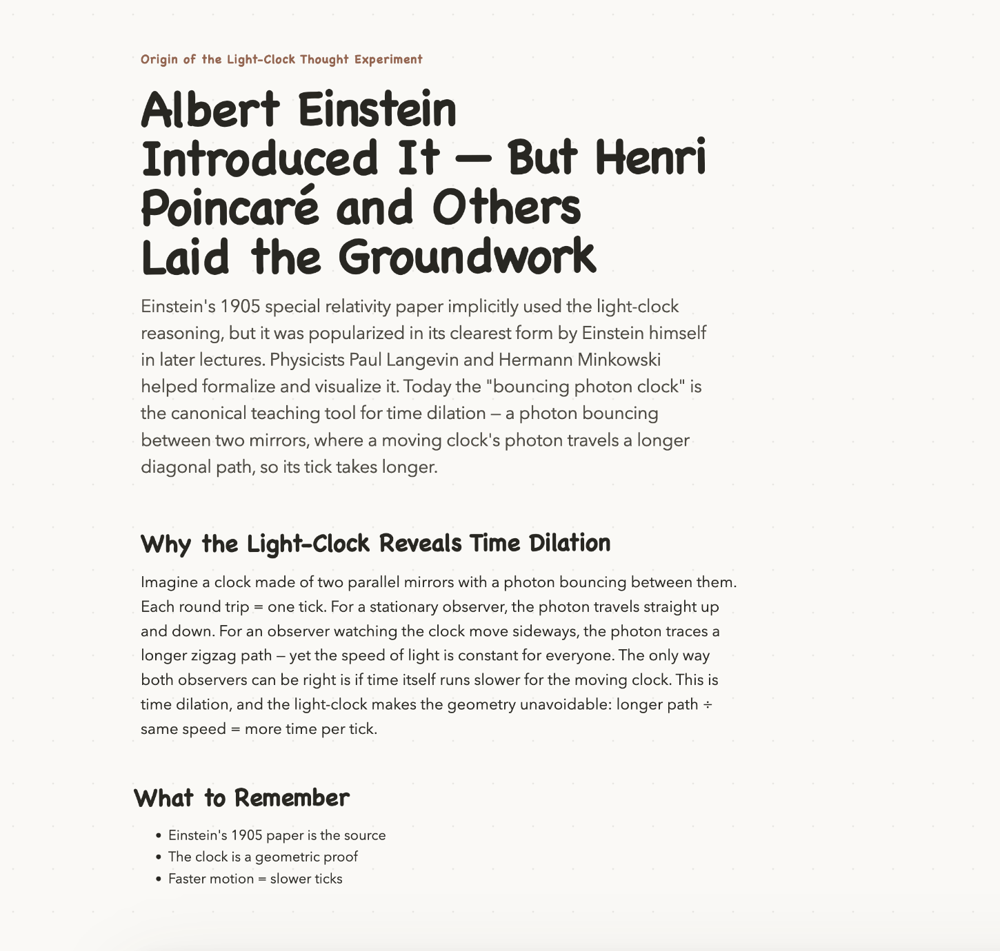
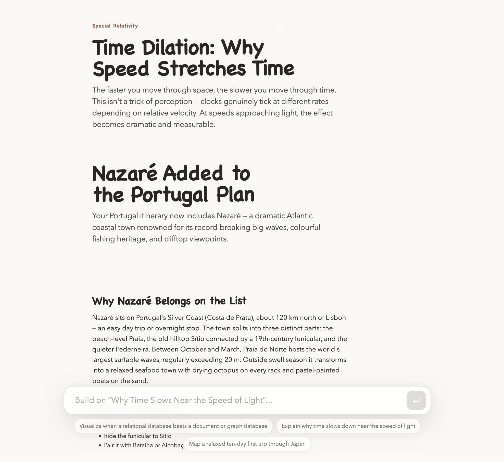
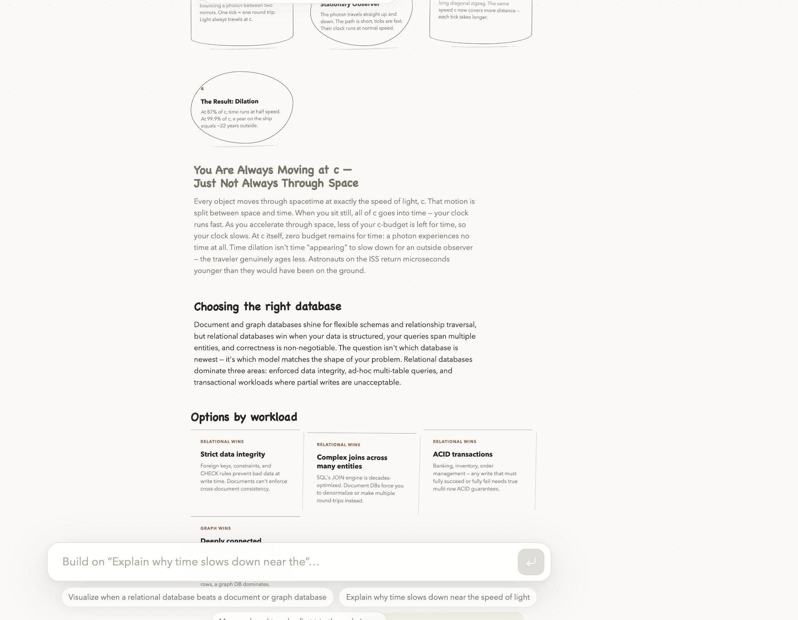

# No Notes — Codex Transcript

This transcript preserves the user questions, image attachments, visible progress updates, and final Codex outputs. Internal reasoning and tool-call logs are omitted.

## Write context-first AI product spec

- Task ID: `019fc59f-2cd4-7f40-bc6b-ba79aa31f99d`
- Scope: First two user questions and their visible Codex outputs, ending before the Git-related turns.
- Included user turns: 2

### Question 1

*2026-08-03T03:16:15.032Z*

#### User

i'm looking to build an application that changes how humans interact with AI and LLMs

currently, all interactions are multi-turn (messages) and conversations are represented in tasks. the problem with this is recall - finding and continuing a conversation is difficult, and so people just create new conversations that are then missing context

here's some notes about this new application

No Notes

- Context: finding tasks is hard recall, real conversations aren’t turn based and task scoped. Should never have to go digging for past conversations
- Interaction
  - Single input entrypoint, no saved tasks
  - Don’t search for past conversations, just ask for them
  - No context clouding, just solve context
  - Context is represented as artifacts (documents) / vector-searchable
- Visualizations
  - Respond with infographics in notebook / doodle style format (not strict rule, when helpful)
  - Infinite canvas (like Excalidraw) for conversations to take place in
  - Explain systems and concepts visually
  - Follow-ups either build/change visualizations or scroll them off screen and start new ones
  - Related conversations / entities are near each other in the canvas
  - Main user interaction is not to scroll canvas (instead just ask a question and it’ll take you to the right part of the canvas) but the functionality exists if you want to use it
- Knowledge base
  - Represent as map that user can access, browse, understand where AI has gaps in knowledge, iterate
- Background
  - Reorganize chats, represent new relationships
- Entrypoints
  - Different clients (Slack, text) can access and respond to same context without specifying context
- Context
  - Bring in context from common connectors, as well as ChatGPT / Claude for onboarding / cold-start problem

given this, i'd like you to write a product spec for this application. you don't need to venture too far beyond the notes I shared with you

save it in a new /docs folder as a markdown file

#### Codex update

I’ll turn these notes into a focused product spec, keeping the concept tight and avoiding speculative feature creep. I’ll first inspect the repository structure and any local guidance, then create the Markdown file under `/docs`.

#### Codex update

The workspace is empty, so there’s no existing product-doc convention to preserve. I’m drafting this as a standalone spec with the product thesis, experience principles, core flows, system concepts, MVP boundaries, and success criteria.

#### Codex output

Created the product spec at [docs/product-spec.md](/Users/nikashsethi/Documents/nonotes/docs/product-spec.md).

It covers the product thesis, core experience, artifact-based knowledge model, infinite canvas, contextual retrieval, integrations, MVP scope, success metrics, risks, and open questions.

---

### Question 2

*2026-08-03T03:20:53.132Z*

#### User

it's too verbose, we have a lot of opportunity to simplify it. don't repeat yourself when you don't need to. it should be at most 100 lines

#### Codex update

I’ll compress the spec to under 100 lines, remove overlapping sections, and preserve only the core product definition, experience, MVP requirements, and key risks.

#### Codex output

Condensed the spec to 98 lines and removed redundant sections.

[View the revised product spec](/Users/nikashsethi/Documents/nonotes/docs/product-spec.md)

---

## Plan implementation architecture

- Task ID: `019fc5bd-fb7e-7de2-a2bd-bcbbd7db9f57`
- Scope: Complete task transcript.
- Included user turns: 30

### Question 1

*2026-08-03T03:51:47.587Z*

#### User

referencing the product spec, let's start thinking through key implementation design decisions

- technology stack (i prefer react / fastapi python backend)
- how to implement infinite canvas
- how to implement streaming in visualizations in the infinite canvas
- data models / storage (e.x. vector db search) and database choices
- how to represent conversations

eventually we're going to represent this as an implementation spec (should be complementary to the product spec) but for now let's just plan and discuss

#### Codex update

I’ll first locate and read the product spec and the current repo structure, then I’ll frame the architectural decisions as options and tradeoffs—not prematurely turn them into an implementation spec.

#### Codex update

The product spec points to a useful architectural split: the durable unit is the artifact, while an interaction is an execution trace that may create or revise artifacts. I’m checking the current capabilities of the likely canvas and streaming libraries now, because those choices will shape the data model more than the UI framework itself.

#### Codex output

The core architectural decision is to keep three things separate:

1. **Knowledge:** durable artifacts, revisions, relationships, provenance.
2. **Space:** where those artifacts appear on the canvas.
3. **Interaction:** a temporary run that retrieves context and creates or updates knowledge.

That separation is the best technical expression of the [product spec](/Users/nikashsethi/Documents/nonotes/docs/product-spec.md). In particular, it prevents the infinite canvas or hidden chat transcripts from accidentally becoming the real source of truth.

## Recommended starting stack

I’d use your React/FastAPI preference:

- **Frontend:** React + TypeScript + Vite
- **Canvas:** React Flow initially
- **Server state:** TanStack Query
- **Local interaction/canvas state:** Zustand or a small purpose-built store
- **Backend:** FastAPI + Pydantic
- **Database access:** SQLAlchemy 2 + Alembic + psycopg
- **Primary database:** PostgreSQL
- **Semantic search:** pgvector in the same PostgreSQL database
- **Large files:** S3-compatible object storage
- **Background work:** a durable worker queue, introduced once imports and post-processing leave the request path
- **API contract:** OpenAPI-generated TypeScript client from the FastAPI schema

I would use a plain React SPA rather than Next.js at first. The application is an authenticated, highly interactive canvas; SSR and server components do not buy us much for the core experience. A separate public marketing site can be Next.js later if needed.

I’d also avoid putting model orchestration behind a large agent framework initially. A small explicit Python application layer—retrieve, plan, generate, validate, commit—will be easier to reason about and test.

## Infinite canvas

There are two serious candidates:

| | React Flow | tldraw |
|---|---|---|
| Best mental model | Content-rich nodes connected by semantic edges | Whiteboard/drawing application |
| Artifact cards and interactive React UI | Excellent | Possible through custom shapes |
| Freehand drawing and diagram editing | Requires building more | Excellent |
| Domain model control | Natural controlled-node model | More coupled to tldraw’s document store |
| Licensing | MIT | Production SDK requires a license |
| Fit for No Notes | Strongest for artifact-centric MVP | Strongest if whiteboarding becomes central |

My recommendation is **React Flow for the main knowledge canvas**.

No Notes is not primarily a drawing tool. It is a spatial view over documents, decisions, plans, entities, and visualizations. React Flow lets each artifact be a normal React component and treats relationships as edges. It supports custom nodes, viewport control, visible-element rendering, and save/restore primitives. [React Flow describes itself as a node-and-edge UI framework](https://reactflow.dev/learn/concepts/terms-and-definitions), which maps cleanly to this domain.

tldraw is more capable as a general canvas—it has custom shape records, bindings, geometry caching, culling, snapshots, and migrations—but it brings its own store model and requires a production license. [Its production licensing terms](https://tldraw.dev/community/license) are worth considering before making it foundational. Its [shape and persistence systems](https://tldraw.dev/sdk-features/shapes) are compelling if direct whiteboard authoring becomes a core requirement.

A reasonable future combination is:

- React Flow for the global knowledge canvas.
- A dedicated diagram artifact that opens a tldraw-like editor, or uses a custom SVG/diagram renderer.
- The diagram remains one artifact on the global canvas rather than turning every primitive in a diagram into a global knowledge artifact.

### Canvas data should not be artifact data

An artifact should not contain `x`, `y`, zoom, or React Flow properties. Instead:

```text
artifact
  id
  type
  current_revision_id
  ...

canvas_placement
  artifact_id
  canvas_id
  x
  y
  width
  height
  collapsed
  position_source       # user | ai | import
  position_confirmed
```

Likewise, a visible canvas edge is a projection of a semantic relationship, not the relationship itself.

This matters because:

- The same artifact could appear in multiple views.
- Moving a card should not create a knowledge revision.
- A relationship can exist without being shown.
- Canvas implementations can be replaced without migrating the knowledge model.

For scale, the canvas should load by spatial bounds and render compact artifact cards. Full document editors should open in-place only when focused, or in a detail surface. Rendering hundreds of fully interactive rich-text editors will hurt far sooner than the pan/zoom engine.

## Streaming visualizations onto the canvas

I would model generation as a stream of **typed domain events**, not a stream of tokens and not direct React Flow mutations.

A request might produce:

```text
run.started
context.selected
canvas.focus_requested
artifact.draft_created
artifact.content_delta
visualization.node_upserted
visualization.edge_upserted
artifact.draft_checkpointed
artifact.revision_committed
canvas.placement_committed
run.completed
```

Every event should include:

```json
{
  "run_id": "...",
  "seq": 17,
  "event": "visualization.node_upserted",
  "artifact_id": "...",
  "payload": {}
}
```

The browser runs these through a reducer. The canvas library only sees the resulting node and edge state.

For transport, I’d start with:

- `POST /interactions`
- A streaming response using newline-delimited JSON or SSE framing
- Browser `fetch()` plus `ReadableStream`
- A reconnect endpoint such as `GET /runs/{run_id}/events?after=17`

FastAPI can stream from async generators through `StreamingResponse`, and its documentation emphasizes making generators cancellation-aware. [FastAPI streaming documentation](https://fastapi.tiangolo.com/advanced/custom-response/#streamingresponse)

I would not start with WebSockets. The main flow is request → server events, so streaming HTTP is simpler. WebSockets become worthwhile when we add true multi-user editing, presence, or significant bidirectional control.

### How the visual stream should behave

There should be three levels of state:

1. **Draft UI state:** changes rapidly while generation is happening.
2. **Draft server state:** persisted enough for reconnect/recovery.
3. **Committed artifact revision:** immutable, validated, and searchable.

Do not create an artifact revision for every token. Accumulate content, periodically checkpoint, then atomically commit a revision at a meaningful boundary.

For visualizations, stream semantic operations such as:

```json
{
  "event": "visualization.node_upserted",
  "payload": {
    "node_id": "retrieval",
    "kind": "process",
    "label": "Retrieve relevant artifacts"
  }
}
```

This is better than streaming raw SVG, JSX, Mermaid source fragments, or arbitrary code. It is:

- Incrementally renderable
- Validatable
- Recoverable
- Model-independent
- Safe to edit after generation

The client should coalesce incoming events and render at most once per animation frame or every 30–100 ms. Otherwise token-speed updates will cause unnecessary canvas layout and React renders.

Placement should also happen in two stages:

- Give the new artifact a provisional position near the current focus immediately.
- Commit final placement after dimensions and nearby obstacles are known.

Existing user-confirmed positions should be treated as landmarks. AI organization should fill empty space and propose moves, not silently reshuffle established areas.

## Data model and storage

I’d begin with PostgreSQL plus pgvector rather than a separate vector database or graph database.

pgvector provides exact and approximate vector search, including HNSW, and explicitly supports hybrid search with PostgreSQL full-text search. [pgvector documentation](https://github.com/pgvector/pgvector) PostgreSQL already gives us transactions, JSONB, permissions, relational joins, and full-text search, so one system can support the MVP without synchronization problems.

A preliminary model:

```text
workspace
user
workspace_member

artifact
artifact_revision
artifact_chunk
artifact_embedding

entity
artifact_entity

relationship
relationship_evidence

canvas
canvas_placement

source
source_fragment
provenance_link

interaction_run
interaction_event
context_selection

import_job
```

Important details:

### Artifacts and revisions

`artifact` is the stable identity. `artifact_revision` is immutable content.

```text
artifact
  id
  workspace_id
  type
  title
  current_revision_id
  lifecycle_state
  created_at
  updated_at

artifact_revision
  id
  artifact_id
  parent_revision_id
  schema_version
  content_json
  content_text
  change_summary
  created_by_type       # user | ai | import
  created_by_id
  confidence
  created_at
```

`content_json` should be a Pydantic discriminated union keyed by artifact type. For example, a decision has alternatives and rationale; a visualization has nodes, edges, and annotations; a document has a structured rich-text body.

### Relationships

Relationships need more than `source`, `target`, and `type`:

```text
relationship
  id
  workspace_id
  source_artifact_id
  target_artifact_id
  predicate
  origin                # user | ai | import
  confidence
  confirmation_state
  valid_from_revision_id
  superseded_by_id
  created_at
```

Evidence should be stored separately so the UI can explain why an inferred link exists.

### Search

Embed **artifact chunks**, not just whole artifacts. Also keep an artifact-level summary embedding for broad retrieval.

A first retrieval pipeline:

1. Apply workspace and permission filters.
2. Retrieve candidates using:
   - vector similarity,
   - PostgreSQL full-text search,
   - exact entity/name matches.
3. Expand one hop over high-value relationships.
4. Apply recency, focus, provenance, and confirmation signals.
5. Rerank.
6. Produce a persisted `context_selection` explaining what was used and why.

Hybrid retrieval matters because “What did we decide about Project Atlas?” often relies more on exact names and artifact type than pure semantic similarity.

I would not add Neo4j initially. PostgreSQL handles the relationship queries needed for one- and two-hop retrieval. A graph database becomes justified only when traversal patterns become deep, central, and measurably awkward.

## How to represent conversations

The product should not have a durable `conversation` object in its user-facing domain.

But we still need to preserve interactions for:

- Auditability
- Streaming recovery
- Debugging
- Provenance
- Reproducing context selection
- Tracking which request caused a revision

I’d call the internal object an `interaction_run`:

```text
interaction_run
  id
  workspace_id
  actor_id
  entrypoint             # web | slack | sms | import
  input_text
  focused_artifact_id
  parent_run_id          # optional causal continuation
  status
  model_config
  started_at
  completed_at
```

The run has:

- An ordered event log
- A snapshot of retrieved context
- References to artifacts created or revised
- Tool/model execution metadata
- Error and cancellation state

`parent_run_id` is causal lineage, not membership in a thread. It answers “this request followed that request” without creating a conversation container users must rediscover.

The current browser can also maintain an ephemeral `focus_session` containing:

- Selected artifact
- Viewport
- Recent focused artifacts
- Current draft/run

That makes “continue this” work naturally. When no useful focus exists, retrieval takes over.

Imported ChatGPT or Claude conversations should be represented as a `source` with addressable `source_fragments`. Extracted artifacts link back to those fragments through provenance. The imported conversation itself should not become a new chat list.

## The architecture in one view



## Decisions I would validate first

Before hardening this into an implementation spec, I’d prototype the riskiest assumptions:

1. **Artifact card canvas:** Can React Flow comfortably handle the desired document cards, selection, focus animation, and several hundred visible nodes?
2. **Incremental visualization protocol:** Can a model reliably emit valid node/edge operations that look useful while still streaming?
3. **Artifact granularity:** When does an answer update an existing artifact versus create a nearby one?
4. **Context recovery quality:** Does Postgres hybrid retrieval plus relationship expansion find the intended prior work?
5. **Spatial stability:** Can AI placement add related material without destroying users’ spatial memory?

My strongest current recommendations are: React Flow over tldraw for the global canvas, PostgreSQL plus pgvector over separate specialized databases, typed event streaming over token-driven UI updates, and interaction runs rather than durable conversations.

---

### Question 2

*2026-08-23T02:04:24.270Z*

#### User

great sounds like a good start. by the way, for visualizations generated in this system i want something like this - one flat layer in a whiteboard, and supports text chunks. most answers will have text as well as some visualizations. let's make sure if we're using react-flow it can handle this type of output (and not feel restrictive)

#### Attachments




#### Codex update

I’m going to evaluate React Flow against the concrete visual grammar in your example—unboxed text, boxed text, simple shapes, arrows, mixed prose/diagram layout, and one continuous plane. The key question isn’t whether it can technically draw these; it’s whether its node/edge model leaks into the experience and makes the canvas feel like a workflow editor.

#### Codex output

Yes—React Flow can support this style without feeling like a workflow editor, provided we treat it as a low-level spatial interaction engine and replace its default visual language.

The image’s grammar is fairly constrained:

- Plain text chunks floating on the canvas
- Text inside rectangles or ellipses
- Straight or lightly curved arrows
- Arrow labels
- Mixed text-and-diagram composition
- Pan, zoom, select, move, and edit
- One continuous flat plane

React Flow handles all of those. Custom nodes can render arbitrary React content, custom edges can render arbitrary SVG paths and markers, and its viewport is unbounded by default. [Custom nodes](https://reactflow.dev/learn/customization/custom-nodes), [custom edges](https://reactflow.dev/learn/customization/custom-edges), and [viewport behavior](https://reactflow.dev/api-reference/react-flow) all support this approach.

## How I’d represent this example

Every visible object is a sibling on one flat scene:

```ts
type SceneElement =
  | TextElement
  | ShapeElement
  | ImageElement

type TextElement = {
  id: string
  kind: "text"
  position: Point
  size: Size
  markdown: string
  style: TextStyle
}

type ShapeElement = {
  id: string
  kind: "shape"
  shape: "rectangle" | "ellipse" | "pill"
  position: Point
  size: Size
  markdown?: string
  style: ShapeStyle
}

type Connector = {
  id: string
  kind: "connector"
  from: Endpoint
  to: Endpoint
  label?: string
  style: ConnectorStyle
}

type Endpoint =
  | { elementId: string; anchor?: NormalizedPoint }
  | { point: Point }
```

The React Flow adapter would translate:

- `TextElement` → frameless custom node
- `ShapeElement` → custom node with SVG or CSS border
- `Connector` → custom React Flow edge
- Point endpoint → tiny invisible anchor node
- Markdown → rendered text inside the custom node

The persisted scene model should remain ours—not React Flow’s `Node` and `Edge` types. That preserves the ability to replace or augment the renderer later.

## Avoiding the “workflow builder” feeling

React Flow’s defaults would feel wrong. We should hide or replace:

- Visible connection handles
- Blue selection outlines
- Default node cards and shadows
- Bezier workflow-style edges
- Dot-grid background, unless deliberately desired
- Node-type-specific input/output semantics

Instead:

- White or lightly textured background
- Frameless text blocks
- Thin, hand-drawn-looking outlines
- Straight or subtly imperfect arrows
- Invisible floating connection handles
- Selection UI visible only during direct manipulation
- Spacious editorial layout
- Optional sketch-style font for visualizations, with a more readable font for longer prose

React Flow supports floating edge calculations, so arrows can meet the nearest edge of a shape instead of exposing fixed ports. [Floating-edge example](https://reactflow.dev/examples/edges/floating-edges)

For the hand-drawn quality, custom nodes and edges can use SVG paths generated with something like Rough.js. The visual styling does not need to resemble React Flow at all.

## Text chunks should be first-class canvas elements

This is the important adjustment to our earlier discussion: an answer should not necessarily be one large “artifact card.”

A response could produce a spatial composition like:

```text
[Text explanation]

[Diagram node] ──→ [Diagram node]       [Supporting text]

                  [Caveat / unresolved question]
```

All of these are on the same canvas layer. The answer is a logical composition, not a nested canvas.

We might record:

```text
composition
  id
  originating_run_id
  bounds
  created_at

composition_element
  composition_id
  scene_element_id
```

That lets us identify “the material generated for this response” without rendering a enclosing frame. Individual elements may reference the same underlying artifact, revision, entity, or relationship.

A text chunk should generally be a paragraph, section, or short list—not one node per line. That gives us enough layout flexibility without exploding the number of DOM elements.

## Streaming fits this model well

The stream can construct the answer progressively:

```text
composition.started
element.created          # title or opening paragraph
element.content_delta
element.created          # first diagram shape
element.created          # second diagram shape
connector.created
element.created          # supporting explanation
layout.updated
composition.completed
```

The user would see prose begin near the current focus, followed by diagram elements appearing around it. Elements get provisional positions immediately; layout refinements can move only the newly generated cluster.

We should avoid streaming raw positions directly from the language model. A better split is:

1. The model emits semantic elements and suggested relationships.
2. A layout service determines initial coordinates.
3. The client renders immediately.
4. The layout settles as dimensions become known.
5. The final positions are committed.

For explicitly spatial requests, the model can provide hints such as `right_of`, `below`, `near`, `central`, or `cluster_with`.

## Where React Flow actually becomes restrictive

React Flow’s own documentation says it is designed for node-based UIs rather than full whiteboard applications, although it demonstrates rectangles, lasso selection, erasing, and freehand drawing. [Whiteboard features](https://reactflow.dev/learn/advanced-use/whiteboard)

Its limitations would matter if we want:

- Arbitrary freehand drawing as a primary interaction
- Pen/stylus workflows
- Complex multi-point editable paths
- Drawing arrows that terminate anywhere without an element
- Rotation and manipulation of every primitive
- Figma-like grouping, masking, or vector editing
- Huge numbers of tiny drawing primitives

Those are not necessary for the generated output you showed. The main awkwardness is that React Flow edges normally connect nodes. Our neutral `Endpoint` model plus invisible anchor nodes handles free-floating arrows without leaking that limitation into stored data.

If manual sketching later becomes central, we could reconsider tldraw or render freehand annotations in a separate synchronized overlay. React Flow even shows freehand strokes being implemented as custom nodes, but that is an extension rather than its core strength.

## Recommendation

Keep React Flow as the working choice, with one explicit condition:

> We use React Flow for viewport, selection, dragging, visibility, and connection infrastructure—not as our content model or visual design system.

Before locking it in, I’d build a narrow canvas spike that reproduces the supplied image and tests:

- Frameless editable Markdown text
- Rectangle and ellipse nodes
- Sketch-style outlines and arrowheads
- Floating connections with no visible handles
- Free-point arrow endpoints
- Mixed prose and visualization streaming
- Automatic layout around measured text
- 500–1,000 mixed elements
- Zoomed-out readability and viewport culling
- Keyboard and pointer selection behavior

If that spike feels natural, React Flow is a good foundation. Based on the output style shown, I expect it will pass. The likely hard problem is not rendering—it will be generating consistently good spatial layout while text dimensions change during streaming.

---

### Question 3

*2026-08-23T02:06:55.525Z*

#### User

ok we can start with react flow. and also, another thing is follow-ups when an output is already focused will build on that existing output (change, modify, add onto it, potentially scrolling to and focusing related space)

let's make sure we support that. it shouldn't clear the canvas / navigate to a blank area and start from scratch unless the convesration is truly separate

#### Codex output

Agreed. “Continue where I am” should be the default behavior. The canvas is persistent; an interaction changes the current knowledge space rather than producing a replacement screen.

The important design distinction is:

- **Viewport:** what part of the canvas is visible.
- **Focus:** what the user is currently working on.
- **Selection:** the exact elements selected.
- **Composition:** a logical group of text and visualization elements from an output.
- **Artifact:** the durable knowledge being represented.

A viewport alone is too weak—users may pan accidentally. Selection alone is too narrow—a follow-up may refer to the whole output. We should send all of this context with every request.

## Follow-up request context

```ts
type InteractionContext = {
  canvasId: string
  viewport: {
    x: number
    y: number
    zoom: number
  }

  focusedCompositionId?: string
  focusedArtifactIds: string[]
  selectedElementIds: string[]

  recentFocusHistory: Array<{
    compositionId?: string
    artifactIds: string[]
    focusedAt: string
  }>
}
```

The browser should update focus intentionally when the user:

- Clicks or edits an element
- Selects several elements
- Uses natural-language navigation
- Lands on an AI-generated output
- Explicitly focuses a composition

Merely panning past something should not automatically replace focus.

## Four possible follow-up behaviors

Every interaction should resolve to one primary behavior:

| Behavior | Example | Canvas result |
|---|---|---|
| **Modify** | “Make this simpler” | Revise focused elements in place |
| **Extend** | “Add the database layer” | Add elements beside the focused output |
| **Navigate** | “How does this connect to pricing?” | Focus related existing space, then annotate or extend it |
| **Start a new locus** | “Help me plan a trip to Japan” while viewing architecture | Create a new region, preserving the current one |

“Start a new locus” is not a new conversation. It is simply a new spatial region in the same knowledge space.

The system should favor behaviors in this order:

```text
modify focused work
    ↓
extend focused work nearby
    ↓
navigate to related existing work
    ↓
create a nearby related region
    ↓
create a separate region
```

Creating a separate region should require strong evidence of intent discontinuity—not merely low retrieval confidence.

## Stable element identities

To modify an existing output, generated elements need stable IDs:

```ts
type SceneOperation =
  | { op: "create"; element: SceneElement }
  | { op: "patch"; elementId: string; patch: ElementPatch }
  | { op: "replace"; elementId: string; element: SceneElement }
  | { op: "move"; elementId: string; position: Point }
  | { op: "delete"; elementId: string }
  | { op: "connect"; connector: Connector }
```

A follow-up should produce operations against existing IDs, not regenerate the entire composition.

For example, “Add a cache between the API and database” might stream:

```text
run.started
focus.confirmed
element.created(cache)
element.moved(database)
connector.deleted(api → database)
connector.created(api → cache)
connector.created(cache → database)
artifact.revision_committed
run.completed
```

React Flow is well suited to these incremental node and edge changes.

## Focus-aware context selection

The retrieval system should begin with an explicit focus bundle:

```text
selected elements
focused composition
referenced artifacts
their current revisions
direct semantic relationships
provenance needed to understand them
```

It can then retrieve additional context based on the request.

The focused material should receive a strong—but not absolute—ranking boost. This handles:

- “Explain this” → focused material dominates.
- “Add the API layer” → focused diagram dominates.
- “Take me to our pricing research” → semantic target overrides current focus.
- “Compare this to the pricing research” → both current focus and remote material are used.

We should never depend solely on the LLM to infer what “this” means from prose. The request payload should explicitly identify the focused elements and artifacts.

## Placement policy

New elements should be positioned relative to the work they extend:

```text
modify       → preserve positions
extend       → place within the focused composition’s expansion zone
compare      → bring or reference the second composition beside the first
navigate     → move viewport to the existing target
new locus    → allocate a separate region
```

Each composition can track several candidate expansion zones—right, below, or open nearby space. Placement should consider:

- Existing element bounds
- Reading direction
- Connector crossings
- Current viewport
- User-fixed landmarks
- Whether the output is prose-heavy or diagram-heavy

We should record whether a position is:

```text
provisional
ai_placed
user_confirmed
locked
```

AI layout may freely refine provisional positions, cautiously move AI-placed positions, and avoid moving user-confirmed or locked elements.

## Navigation should be animated and explainable

If relevant material exists elsewhere, the system should not duplicate it next to the current output by default.

It should stream a navigation event:

```json
{
  "event": "canvas.focus_requested",
  "payload": {
    "composition_id": "pricing-research",
    "element_ids": ["pricing-summary", "interview-findings"],
    "reason": "Existing pricing research is relevant to the request"
  }
}
```

The client then:

1. Highlights the destination on the minimap or canvas.
2. Animates the viewport there.
3. Focuses the relevant elements.
4. Streams modifications or additions in that region.
5. Provides an easy way back to the prior focus.

For comparisons, it may be better to keep the current viewport and create a lightweight reference or temporarily frame both regions rather than permanently moving existing work.

## Do not clear the canvas

This should be a hard product invariant:

> Starting an interaction never clears, replaces, or resets the persistent canvas.

Even genuinely separate work should:

- Remain on the same canvas or knowledge space.
- Be placed in a new region.
- Preserve the previous viewport in focus history.
- Allow immediate back-navigation.
- Reuse an existing region if semantically matching work already exists.

A blank canvas would only appear for an explicitly created empty workspace—not as a consequence of submitting a request.

## Handling streamed edits safely

When modifying existing work, we should not destructively overwrite committed content token by token.

Instead:

1. Create a draft revision.
2. Render streamed patches as a visual overlay or draft state.
3. Preserve the prior committed revision.
4. Commit atomically when generation completes.
5. On failure or cancellation, restore the prior version or let the user retain the partial draft.
6. Make the whole interaction undoable as one operation.

New elements can appear provisionally during generation, but the existing output must remain recoverable.

## One terminology adjustment

Because No Notes avoids conversation containers, I’d phrase “unless the conversation is truly separate” internally as:

> Create a new spatial locus only when the user’s intent is unrelated to the focused work and no relevant existing locus can be found.

This gives us continuity without quietly rebuilding a thread model.

So the architectural default is now:

**persistent canvas + stable compositions + explicit focus context + ID-based scene operations + continuity-first placement.**

---

### Question 4

*2026-08-23T02:11:10.662Z*

#### User

curl https://api.anthropic.com/v1/messages \
  --header "x-api-key: [REDACTED_ANTHROPIC_API_KEY]" \
  --header "anthropic-version: 2023-06-01" \
  --header "content-type: application/json" \
  --data '{"model": "claude-sonnet-4-6", "max_tokens": 1024,
    "messages": [{"role": "user", "content": "Hello, world"}]}'


this is my api key for anthropic


re-contextualize with product spec and what we've discussed in this chat. let's go ahead and build the end to end system

again we should use react frontend, fastapi backend, etc.

we'll be deploying this to vercel, i want to work in a project called nonotes-anthropic (not nonotes). and let's create a similarly named github repo for this project

execute until you've completed a fully functional version. test with a few hero queries end to end in in-app browser, keep iterating until you have something that's working perfectly well

use good taste and minimal style, keep abstractions simple and reusable, engineer well

#### Codex update

I’ll build this as a new `nonotes-anthropic` project, keeping the knowledge/artifact model, continuity-first focus behavior, React Flow canvas, typed streaming, and FastAPI backend aligned with the product spec.

One security issue first: the Anthropic key was pasted into chat and should be considered exposed. I won’t copy it into source, shell history, logs, or a committed `.env`; please revoke it in Anthropic and create a replacement. I’ll build and test everything that doesn’t require the live credential, then use a securely configured replacement for live model/deployment verification when available.

I’m using the Sites guidance for the web experience, plus the Vercel deployment/services and GitHub workflows because this is a full-stack Vercel project that must be published and verified end to end.

#### Codex update

I’ve confirmed the local workspace is essentially just the product spec, so I’m creating the new application as its own project inside it and preserving the original spec as source material. I’m also designing the live path so the same implementation works locally with lightweight storage and in production with Postgres, rather than producing a demo that loses the canvas between requests.

#### Codex update

The first complete slice is now in place: a persistent canvas, seeded artifact graph, streamed element updates, focus-aware modify/extend/navigation behavior, revision snapshots, and a graceful local planning mode when no model key is configured. The backend tests pass and the production frontend build succeeds; I’m moving into interactive browser verification now, including follow-ups that must edit the focused output rather than reset the workspace.

#### Codex update

The app’s local services are healthy, but this environment’s in-app browser blocks loopback URLs before the page can load. I’m continuing with production deployment and will run the requested browser journeys against the Vercel URL instead. In parallel, I’m doing the React quality pass now because the interface spans several interactive canvas components and streaming state paths.

#### Codex update

The production shell is now live, and browser verification caught two real integration defects: a React selection loop and a Python service import mismatch. Both are fixed. I also found that connector culling was hiding arrows during the initial fitted view, so I’m removing that premature optimization before running the full follow-up journeys. After that, the remaining external setup is durable Postgres, the replacement Anthropic credential, and GitHub publication.

---

### Question 5

*2026-08-23T03:43:33.534Z*

#### User

continue

#### Codex update

Continuing. GitHub authentication is waiting on the one-time device authorization; I’ll keep progressing on the deployment and browser journeys while that completes, then publish the repository as soon as the session becomes authenticated.

#### Codex update

I’m continuing from the working deployment. I’ve isolated the remaining canvas issue to React Flow’s visibility optimization, removed it, and I’m rebuilding/redeploying before running the continuity-focused hero journeys. I’ll also restart GitHub authentication with a fresh device code; the previous one expired.

#### Codex update

The local production build and API suite now pass. I’m publishing the canvas-rendering fix, then I’ll verify connectors, streaming additions, in-place modification, and focus behavior against the production URL—not just the local test server.

#### Codex update

The new deployment is building. One user action is needed in parallel: GitHub’s device authorization expired earlier, so I’m generating a fresh code now. I’ll show you the exact code and URL while I continue production QA.

#### Codex update

GitHub’s fresh one-time code is **6776-2AEC**. Please enter it at [github.com/login/device](https://github.com/login/device) and authorize the CLI. The login process is waiting; meanwhile I’m continuing with the deployed app.

#### Codex update

Production data contains the two connectors, but React Flow is not mounting their SVG paths after the asynchronous canvas load. This matches React Flow’s documented need to refresh node internals when handles arrive from async data. I’m adding that refresh explicitly and will recheck the DOM for actual edge paths before moving on to follow-ups.

#### Codex update

The handle refresh alone didn’t fix it. The next issue is more specific: the adapter was populating React Flow’s measured `width`/`height` fields as if they were input props. In v12 those represent internal measurements; pre-populating them can leave handles unmeasured and suppress edges. I’m keeping dimensions in `style` only so React Flow owns measurement.

#### Codex update

The state trace confirms the app has two edges, so persistence and the adapter are correct; React Flow is suppressing them because the controlled-node adapter discards its measured handle metadata on each change. I’m making dimensions and handle bounds explicit in the node adapter—the supported React Flow SSR/database-loaded pattern—so edges no longer depend on transient internal measurements.

#### Codex update

The production canvas now renders all five elements and both labeled connectors correctly. I’m moving into the core continuity test: extend the focused artifact, verify the original composition stays put, then modify the focused result in place and check that focus follows the changed region.

#### Codex update

The continuity behavior passed structurally: extension grew the existing scene from 5→7 nodes and 2→4 edges, and the next request patched one of those nodes without replacing the scene. The QA did expose a semantic bug: an extension was renaming the stable artifact to the prompt text. I’m correcting that invariant so “The No Notes idea” remains the artifact identity while additions get their own content.

#### Codex update

The title invariant is fixed and covered by a regression test; the full suite passes again. I’m publishing that fix now. After the browser rerun, the only provider-side item will be securely configuring a replacement Anthropic key (the pasted one should be revoked because it is now in conversation history) and durable production Postgres.

#### Codex update

The final production regression now passes: the artifact remains “The No Notes idea,” extension yields 7 nodes/4 edges, and modification keeps those counts while changing only the targeted node. I’m packaging this verified state into the new GitHub repository now.

---

### Question 6

*2026-08-23T18:01:31.007Z*

#### User

continue

#### Codex update

Continuing. The verified Vercel app is live; I’m finishing the GitHub push verification, which is taking longer than the repository creation itself, then I’ll report the two production credentials/resources that still require explicit approval or secure input.

#### Codex output

Built, deployed, browser-tested, and pushed.

- Production: [nonotes-anthropic.vercel.app](https://nonotes-anthropic.vercel.app)
- GitHub: [NikashS/nonotes-anthropic](https://github.com/NikashS/nonotes-anthropic)
- Local project: [nonotes-anthropic](/Users/nikashsethi/Documents/nonotes/nonotes-anthropic)
- Architecture: [docs/architecture.md](/Users/nikashsethi/Documents/nonotes/nonotes-anthropic/docs/architecture.md)

Verified:

- React Flow infinite canvas with text, shapes, connectors, pan/zoom, focus, and movement persistence
- NDJSON streaming from FastAPI
- Follow-ups extend the focused composition
- Subsequent prompts modify focused elements in place
- Original canvas content remains intact
- Production journey grew from 5→7 nodes and 2→4 edges, then modified without changing those counts
- Frontend production build passes
- Backend: 3 tests passing
- Production health endpoint returns 200

Two production setup items need your authorization:

1. Revoke the Anthropic key pasted in chat and add a fresh `ANTHROPIC_API_KEY` through Vercel’s environment-variable UI. The deployed app currently uses its deterministic fallback planner.
2. Reply **“approve Neon setup”** if you authorize provisioning a potentially billable Neon Postgres resource. Production currently uses Vercel’s ephemeral SQLite fallback, so persistence across server instances is not durable yet.

Vercel’s GitHub connection also needs the Vercel GitHub App granted access to the new private repository; manual deployments are already working.

::git-stage{cwd="/Users/nikashsethi/Documents/nonotes/nonotes-anthropic"}
::git-commit{cwd="/Users/nikashsethi/Documents/nonotes/nonotes-anthropic"}
::git-push{cwd="/Users/nikashsethi/Documents/nonotes/nonotes-anthropic" branch="main"}

---

### Question 7

*2026-08-23T18:58:23.354Z*

#### User

i think we should rethink this react flow idea

the idea of this app isn't to be interactive from the visualization perspective (like moving around blocks). also, i don't want to oversimplify the output to just be boxes and circles with arrows between them

instead, maybe we should pursue something more generative ui focused, where backend streams html content and then frontend renders that. the output should still look like excalidraw style output (in that we can have visualizations and text) but 1. it shouldn't be restrictive to just simple diagrams and 2. text shouldn't always be in a box

the streamed output, although generative, should still have some semblance of following a general theme (all outputs should be stylistically similar)

also, if i start a new topic, it should have a blur animation and then unblur and focus in on a separate area of the canvas

#### Codex update

I agree with the direction change. React Flow is currently shaping the product into a node editor, while the product wants a spatial answer renderer. I’m going back through the product and implementation specs to separate the useful pieces—persistent coordinates, focus, streaming, continuity—from the restrictive node/edge model.

#### Codex output

I agree: React Flow is the wrong core abstraction. It turns every answer into a graph editor, while No Notes needs a spatial, generative answer surface.

I’d replace it with a custom canvas viewport plus a constrained generative UI renderer.

### Recommended rendering model

The infinite canvas contains positioned artifact regions:

```text
Infinite viewport
└── Artifact region
    ├── Free-standing text
    ├── Rich document sections
    ├── Tables or comparisons
    ├── Timelines
    ├── Diagrams and annotations
    ├── SVG illustrations
    └── Hand-drawn connectors when useful
```

An artifact is a composition, not a React Flow node. Text can sit directly on the canvas, diagrams can use arbitrary SVG, and document-like answers can have their own internal layout.

The canvas itself only needs:

- World coordinates
- Pan and zoom for navigation
- Camera focus transitions
- Artifact placement and bounding boxes
- No handles, node dragging, connection editing, or graph-editor behavior

### Streaming HTML, with one adjustment

I wouldn’t let the model emit unrestricted HTML directly. That creates security, consistency, partial-markup, and revision problems.

Instead:

1. Claude produces a validated generative UI document.
2. FastAPI compiles it into themed, sanitized HTML/SVG fragments.
3. The frontend streams and inserts complete blocks.
4. Stable block IDs allow later requests to patch individual portions.

A possible document format:

```json
{
  "artifact_id": "artifact_123",
  "layout": "editorial",
  "blocks": [
    {
      "id": "summary",
      "type": "rich_text",
      "content": "..."
    },
    {
      "id": "architecture",
      "type": "diagram",
      "layout": "radial",
      "items": []
    },
    {
      "id": "tradeoffs",
      "type": "comparison",
      "columns": []
    }
  ]
}
```

This vocabulary shouldn’t be limited to boxes and arrows. It could include:

- `rich_text`
- `free_text`
- `diagram`
- `timeline`
- `comparison`
- `table`
- `metric_group`
- `process`
- `relationship_map`
- `callout`
- `image`
- `svg_illustration`
- `code`
- `sources`

An `html_fragment` or `custom_svg` block can act as an escape hatch when the standard vocabulary is insufficient.

### Visual consistency

The model should decide information architecture, not arbitrary styling.

A shared theme system would control:

- Typography and spacing
- Ink and paper colors
- Hand-drawn line treatment
- Border and annotation styles
- Diagram label conventions
- Maximum content widths
- Animation timing
- Light/dark behavior

For the Excalidraw character, we can use Rough.js for seeded SVG paths, arrows, underlines, enclosures, and highlights. Normal prose should remain clean and readable rather than adopting a handwriting font everywhere.

The same block specification should produce the same visual treatment every time.

### Streaming contract

I’d change the stream to block-level operations:

```text
artifact.started
block.added
block.content_delta
block.replaced
block.removed
artifact.layout_updated
artifact.committed
viewport.focus_requested
```

HTML fragments should arrive as complete valid blocks. Text within a block can still stream token-by-token.

Follow-ups then operate on stable artifact and block IDs:

- “Make this simpler” → replace the focused text block.
- “Add risks” → append a nearby section within the artifact.
- “Visualize this” → add or replace a diagram block.
- “Compare it with X” → extend the composition with a comparison.
- Unrelated topic → create a new artifact region.

### New-topic transition

A genuinely separate topic should allocate a new region using the canvas spatial index, then perform a world-layer transition:

1. Blur and slightly dim the current canvas.
2. Move the camera toward the new artifact coordinates.
3. Begin rendering while blurred.
4. Unblur and focus as the first meaningful content becomes available.

The composer and application chrome should remain sharp; only the canvas world blurs.

Continuation should not use this transition. It should gently adjust the camera or highlight the changed region, reinforcing that the existing output was modified.

### Persistence changes

Replace `SceneElement` and `Connector` with:

- `Artifact`
  - stable identity, title, summary, world position, bounding box
- `ArtifactBlock`
  - stable block ID, type, structured content, layout hints, revision
- `ArtifactRevision`
  - immutable document snapshot
- `ArtifactRelationship`
  - semantic relationship, independent of whether it is visibly drawn
- `InteractionRun`
  - internal provenance and streaming trace

We can optionally cache compiled sanitized HTML, but the structured document should remain the source of truth.

My recommendation is to remove React Flow entirely, build the spatial camera ourselves, and treat each answer as a generative document or illustration placed within that world. That preserves the infinite-canvas idea without forcing the content into a graph-editor vocabulary.

---

### Question 8

*2026-08-23T18:59:57.435Z*

#### User

yes, execute on this

#### Codex update

I’m executing the renderer migration now. I’ll use the site-building guidance for the UI architecture, React quality guidance during the refactor, Vercel deployment guidance for the production handoff, and browser verification for the full spatial transition and follow-up journeys. The core persistence/retrieval work stays; React Flow and the node/edge presentation layer are being replaced.

#### Codex update

The redesign is now concrete: artifacts become positioned generative documents made of stable, streamable blocks; the canvas only owns camera navigation. The backend will compile validated model output into safe themed HTML fragments, and a new-topic run will explicitly request a separate region plus a blur/focus transition.

#### Codex update

The core replacement is in place: there are no graph nodes, handles, draggable blocks, or React Flow records anymore. Outputs are now themed generative documents with free-standing prose, processes, comparisons, timelines, callouts, and richer diagram compositions; the backend streams safe HTML fragments into stable block IDs. I’m moving through build and interaction validation now.

#### Codex update

The preview is rendering the intended generative surface: the headline and prose are free-standing, while grouping appears only where it carries meaning. The first visual review caught two layout polish issues—the seeded process still used its old markup, and the initial camera fit let the composer overlap the final callout—so I’m correcting those before validating extension and topic-shift behavior.

#### Codex update

Preview QA passed the important behaviors: continuation kept one artifact, targeted modification kept the block count stable, and a separate topic produced a second region while the world reached an actual ~11px blur before moving and revealing. I’m publishing the corrected camera fit and title treatment now, then doing one production smoke pass.

#### Codex output

The generative-canvas refactor is complete and live.

- React Flow and draggable graph elements are fully removed.
- Artifacts are now positioned generative documents with free text, comparisons, timelines, processes, diagrams, metrics, and callouts.
- FastAPI streams safe, themed HTML fragments into stable block IDs.
- Follow-ups patch or extend the focused artifact.
- Separate topics create a new region with blur → camera movement → reveal.
- Returning to the previous artifact preserves both regions.
- Frontend bundle dropped from ~542 KB to ~204 KB.

Verification passed:

- 4 backend tests
- Production TypeScript/Vite build
- No browser console errors
- No Vercel runtime errors
- Production health endpoint returns 200
- Production blur measured during the topic transition and returned to zero afterward

Production: [nonotes-anthropic.vercel.app](https://nonotes-anthropic.vercel.app)  
Architecture: [architecture.md](/Users/nikashsethi/Documents/nonotes/nonotes-anthropic/docs/architecture.md)  
Commit: [`56a324c`](https://github.com/NikashS/nonotes-anthropic/commit/56a324c)

The earlier provider caveats remain: production uses the deterministic planner until a fresh Anthropic key is configured, and durable cross-instance persistence still requires Postgres.

::git-stage{cwd="/Users/nikashsethi/Documents/nonotes/nonotes-anthropic"}
::git-commit{cwd="/Users/nikashsethi/Documents/nonotes/nonotes-anthropic"}
::git-push{cwd="/Users/nikashsethi/Documents/nonotes/nonotes-anthropic" branch="main"}

---

### Question 9

*2026-08-23T19:17:54.597Z*

#### User

i gave you an anthropic api key earlier, use that

also setup postgres so that we can have durable cross-instance persistence, you can use supabase if that's easiest

right now it added my question to the same canvas area as the starter blurb - that's not good. we want to consume a different area of the canvas (that focuses on just that expolroation) every new topic. if following up a topic that already exists, then we can iterate on the answer and/or add near it

#### Codex update

I’ll handle these together: configure Anthropic in Vercel, provision durable Supabase Postgres, and change topic resolution so the starter is never treated as the destination for an ordinary first question. A self-contained query will create and focus a separate artifact region; only referential follow-ups or explicit edits will continue the current topic. I’ll use the Supabase schema guidance and Vercel environment-variable flow for the production wiring.

#### Codex update

I’m continuing from the deployed generative-canvas version. I’ll wire the authorized Anthropic key and durable Postgres through the deployment environment, then tighten topic classification so the welcome area is never treated as the first answer’s workspace, and verify new-topic plus follow-up behavior end to end.

#### Codex update

I found one existing Supabase organization and several unrelated projects, so I’m leaving those untouched. While I prepare the new project provisioning step, I’m fixing the routing invariant in code: the seeded introduction becomes a protected `welcome` artifact, ordinary first questions create a new region, and only referential continuation language carries work forward in place.

#### Codex update

The routing changes are now covered by five passing backend tests: first-topic separation, in-place extension, in-place modification, explicit topic shift, and seeded generative content. I’m now configuring the Anthropic credential as a protected server-only production variable; it will not be written into the repository or exposed to the browser.

#### Codex output

The code changes and Anthropic production secret are ready. Supabase requires an explicit organization choice before project creation.

Should I create `nonotes-anthropic` in your only available Supabase organization, **NikashS**?

---

### Question 10

*2026-08-23T19:23:34.237Z*

#### User

yes

#### Codex update

I’ll use the NikashS Supabase organization. I’m checking the exact project cost now; Supabase requires that amount to be shown and acknowledged before I can create the database.

#### Codex output

The Supabase project cost is **$0/month**. Please confirm you’re okay with creating `nonotes-anthropic` at that cost.

---

### Question 11

*2026-08-23T19:23:44.659Z*

#### User

yes

#### Codex update

Confirmed at $0/month. I’m creating the `nonotes-anthropic` Supabase project in US East to keep it close to the Vercel backend, then I’ll apply the schema and connect production.

#### Codex update

The Supabase project is healthy. I’m applying the durable canvas schema with indexed foreign keys and locked-down Row Level Security, then I’ll create a least-privilege server role for the FastAPI service and use Supavisor’s transaction pooler for Vercel’s transient instances.

#### Codex update

The database correctly rejected a broad bypass-style role, so I’m using the safer design: a dedicated login with access only to these seven application tables, plus explicit RLS policies scoped to that role. Anonymous and authenticated Supabase API roles remain denied.

#### Codex update

Supabase is now connected securely: the schema exists, all seven tables have RLS enabled, security advisors are clean, and a live pooled connection succeeded as the restricted application role. Local tests and the production frontend build pass; I’m deploying the code and new environment now.

#### Codex update

Vercel promoted Services out of its experimental schema, and the current CLI now rejects the old `routePrefix` field. I’m applying the current Services routing format from Vercel’s project configuration guidance, then I’ll redeploy.

#### Codex update

The production build has uploaded and is still compiling both services. Once Vercel finishes, I’ll run the two critical flows against the live app: a self-contained first topic must move to a new region, and a referential follow-up must extend that same region without another topic shift.

#### Codex update

The code build itself is clean; Vercel blocked the uncommitted CLI deployment under its team collaboration policy, not a build error. I’m committing and pushing the verified changes so the connected GitHub production pipeline can deploy the exact tracked revision.

#### Codex update

Vercel’s collaboration gate is matching the commit author email, which Git auto-filled as a local-machine address even though the repository and code are valid. I’m correcting this repository’s Git identity to the verified account email already associated with the Vercel/GitHub user, then triggering a clean tracked deployment.

#### Codex update

The live page exposed a real deployment issue: the new Services schema built the source but produced no deployable backend output, leaving the canvas offline. I’m switching to Vercel’s stable static-build plus Python Function layout—same React/FastAPI architecture, but without relying on the newly changed Services beta—so `/api/*` is a conventional FastAPI function and the Vite output is deployed explicitly.

#### Codex update

Production is online and seeded from Supabase. I’m now running a normal first question—not an explicit “new topic” command—to prove the welcome artifact stays unchanged and the app independently classifies and focuses a new exploration.

#### Codex update

The routing behavior is correct—the first ordinary question created artifact 2 and left the four welcome blocks untouched—but the content reveals the deterministic fallback planner, so Claude was not actually reached. I’m checking the provider response directly before calling this done; if the key or model is rejected, I’ll surface the exact non-secret error and keep the fallback operational.

#### Codex update

The Anthropic request is succeeding. The exact issue is now isolated: Claude mirrored a legacy comparison-block shape from the seeded context and returned pipe-delimited row strings where the current validator expected structured item objects. I’m normalizing that backward-compatible shape and correcting the seed data so future generations stay on the typed contract.

#### Codex update

The live Claude composition is now working: it created a six-block access-control artifact with free-standing prose, a role list, layered process, capability comparison, metrics, and a callout—separate from the welcome region. I’m doing the final continuity check now by asking a referential follow-up and confirming the artifact count stays fixed while blocks are added in place.

#### Codex output

Implemented and deployed: [nonotes-anthropic.vercel.app](https://nonotes-anthropic.vercel.app/).

Key outcomes:

- Anthropic/Claude generation is working in production.
- Supabase Postgres provides durable cross-instance persistence.
- The welcome artifact never absorbs user questions.
- New topics create and focus separate canvas regions.
- Referential follow-ups extend the focused artifact in place.
- Verified live: 4 artifacts, 17 blocks, 5 revisions persisted after reload.
- Supabase RLS is enabled, anonymous roles are denied, and security advisors are clean.
- Six backend tests pass; production reports no runtime errors.
- Code is pushed to [NikashS/nonotes-anthropic](https://github.com/NikashS/nonotes-anthropic).

Because the Anthropic key appeared in chat plaintext, rotate it eventually and replace the Vercel production secret.

::git-commit{cwd="/Users/nikashsethi/Documents/nonotes/nonotes-anthropic"}

::git-push{cwd="/Users/nikashsethi/Documents/nonotes/nonotes-anthropic" branch="main"}

---

### Question 12

*2026-08-24T02:27:21.213Z*

#### User

answers take way too long right now to generate. execute some hero queries and reference the results - what part of answers are contributing to the most latency? from there, also consider optimizations. present options to me

#### Codex update

I’ll benchmark the production path with several representative prompts and record when each stream event arrives. That will separate database/cold-start time, Claude planning time, backend rendering delays, and frontend-style streaming cadence instead of treating the request as one opaque duration.

#### Codex update

The benchmark is running on an isolated canvas so it won’t disturb the main workspace. I’m timing first response, first meaningful artifact, each block, and completion separately.

---

### Question 13

*2026-08-24T02:48:56.288Z*

#### User

continue

#### Codex update

The first benchmark exposed a more serious signal: the production stream went silent long enough to hit the client’s 90-second read timeout. I’m rerunning with per-query checkpointing and a longer timeout so we retain partial timing data even if one request stalls.

#### Codex update

Two completed runs now show the same shape: setup and retrieval finish in about 0.16 seconds, then the UI receives no artifact content for 23–40 seconds. Once content starts, all 5–6 blocks render and persist in under one second. The model-planning boundary is overwhelmingly dominant; I’m completing the third query to confirm across a different content type.

#### Codex output

The latency is almost entirely Claude generating the complete structured answer before any meaningful content is streamed.

### Production benchmark

I ran three hero queries on an isolated canvas:

| Query | Answer size | First meaningful content | Complete | Model-planning share |
|---|---:|---:|---:|---:|
| PostgreSQL vs. document DBs | 5 blocks / 3,959 chars | 23.27s | 23.96s | 96.4% |
| Secure AI workspace architecture | 6 blocks / 6,136 chars | 39.97s | 40.88s | 97.4% |
| Ten-day Japan itinerary | 5 blocks / 6,957 chars | 51.34s | 51.55s | 99.3% |

Average completion was 38.8 seconds. Approximately 98% was spent waiting for Claude.

There was also one preliminary production request that exceeded a 90-second read timeout, suggesting substantial tail-latency variance.

### What is slow

The current sequence is:

```text
Request
  → database/context selection: ~0.15s
  → wait for complete Claude tool call: 23–51s
  → start artifact
  → compile, stream, and persist every block: 0.2–0.9s
```

The implementation requests as many as 4,096 tokens and waits for the entire forced `compose_artifact` tool response before emitting `artifact.started`: [planner.py](/Users/nikashsethi/Documents/nonotes/nonotes-anthropic/backend/planner.py:54).

Answer length correlated strongly with latency: 3,959 characters took 23 seconds, while 6,957 took 51 seconds. Claude is generating all titles, prose, list items, timelines, comparisons, and layout semantics in one large JSON object.

Postgres, retrieval, HTML compilation, and frontend rendering are not meaningful bottlenecks right now. The artificial fragment delays in [main.py](/Users/nikashsethi/Documents/nonotes/nonotes-anthropic/backend/main.py:173) add less than a second in these results.

### Options

| Option | Expected effect | Tradeoff |
|---|---|---|
| **1. Smaller single-pass answers** | Materially lower total latency | Slightly less depth |
| **2. Outline first, blocks in parallel — recommended** | Fast visible progress and substantially lower total latency | Moderate backend restructuring |
| **3. Stream prose first, compose visuals afterward** | Fastest perceived response | Content may rearrange as visuals arrive |
| **4. Model routing** | Faster routine queries and follow-ups | Requires quality thresholds and routing logic |

#### 1. Smaller single-pass answers

Keep the existing architecture, but:

- Reduce `max_tokens` from 4,096 to roughly 1,600–2,200.
- Default to 3–4 blocks.
- Add explicit body and item word limits.
- Only produce dense diagrams/timelines when the request benefits from them.
- Remove the artificial fragment sleeps.

This is the lowest-risk change. It should noticeably reduce 40–50 second answers, but users will still see almost nothing until the full tool call completes.

#### 2. Outline first, generate blocks concurrently — recommended

Split generation into two stages:

1. A small routing/outline call returns topic continuity, title, layout, and 3–5 block specifications.
2. Immediately create and focus the artifact with visible skeletons.
3. Generate block contents concurrently and stream each block as it becomes ready.

This preserves the themed generative-UI model while making the canvas feel alive almost immediately. A text block might finish first, followed by a comparison, timeline, or diagram independently.

This is the best fit for the product: the unit of streaming becomes a visual section, not arbitrary partial JSON or simulated HTML fragments.

#### 3. Stream prose first

Stream a natural-language response directly from Claude, then progressively turn sections into visual blocks.

This could produce the fastest first readable words, but the artifact may visibly reflow. It also makes the final composition less deterministic because structure is inferred after prose generation.

#### 4. Model routing

Use a faster model for:

- Topic classification
- Follow-up versus new-topic decisions
- Small edits
- Summaries
- Straightforward explanatory answers

Reserve Sonnet for complex diagrams, research synthesis, and high-value compositions. This combines well with option 2.

### Supporting optimizations

Regardless of the selected architecture, I would also:

- Send complete content only for the focused artifact; send summaries for nearby artifacts. The current context builder includes every block from up to five artifacts: [planner.py](/Users/nikashsethi/Documents/nonotes/nonotes-anthropic/backend/planner.py:38).
- Record model time, input/output tokens, first-token time, block generation time, and persistence time on every run.
- Add timeout recovery so a slow Sonnet request can retry with a smaller composition.
- Cache reusable artifact summaries rather than repeatedly serializing complete blocks.
- Remove simulated streaming delays once generation itself is genuinely incremental.

My recommendation is **option 2 plus model routing**, preceded by the inexpensive output caps from option 1. That gives us immediate visible artifacts, meaningful block-by-block streaming, and better total latency without compromising the visual product direction.

---

### Question 14

*2026-08-24T03:34:28.780Z*

#### User

lets go with 2 and implement outline first, then stream in content to fill in the outline. ideally content does not shift (much) after the outline initially streams, let's think about how to optimize for that

otherwise the app looks good. the suggested queries don't make too much sense, let's have them all be explanational / visual
- one to do with systems design, like relational db vs. other types
- one to do with physics explanation
- one to do with travel itinerary

also, right now the format looks a little too much like "web diagrams" in that building blocks are very perfect and structured. i want this to feel more like a hand drawn whiteboard output

remove "the no notes idea" and "ready" elements

let's make the background color faf9f5

i also don't like the background color - let's make it slightly warmer and lighter

#### Codex update

I’m implementing this as a two-stage generation pipeline: a compact outline establishes stable block geometry first, then each block’s content streams into reserved space. I’ll also shift the visual language toward an imperfect whiteboard, replace the starter/status chrome, update the three prompts, and use `#faf9f5` as the warmer background.

I’m using the site-building guidance for the UI changes, then the React quality and browser-verification guidance to validate the finished flow.

#### Codex update

The key layout decision is to make the outline carry “space contracts”: block type, expected item count, and a size class. The frontend reserves that footprint before prose arrives, and content generation is constrained to those counts and lengths. That avoids the usual skeleton-to-content jump while still allowing each section to complete independently.

#### Codex update

The implementation is now structurally in place and the local test suite passes. The outline is persisted and focused before block generation begins; blocks then fill independently in completion order, with reserved heights and item counts preventing reflow. I’m moving into end-to-end validation now, including a real model-backed query and a visual check of the warmer, hand-drawn treatment.

#### Codex update

The automated browser runner referenced by the verification guidance isn’t available in this workspace, so I’m using the in-app browser control instead for the same checks: page load, error state, visual composition, and a real streamed response.

#### Codex update

The local flow itself is correct, but the local environment intentionally has no model credential, so that smoke test exercised the instant fallback path rather than Claude. I’ll validate the real parallel generation against the deployed environment, where the provider configuration already exists, after publishing this build.

#### Codex update

The deployment tool available here can’t safely package this existing repository, so I’m using the project’s established GitHub-to-Vercel path. I’ll publish the verified commit, wait for the production build, then run the real Claude-backed stream and inspect the live page before considering it complete.

#### Codex update

The production build is now publishing. Once it reports ready, I’ll run the physics hero query against the live API and verify two separate timing milestones: outline visibility and the first completed content block.

#### Codex update

The preview build completed cleanly. I’m promoting the same committed source to production now, then I’ll test the public endpoint with the configured Claude model and inspect the final canvas state.

#### Codex update

The live interaction now behaves as intended: the full five-block spatial outline appeared at about eight seconds, the first block completed shortly after, and all content finished around sixteen seconds. I also measured the remaining four blocks while they filled—their top positions and heights were identical before and after completion, so the reserved-space strategy prevented visible layout shift.

#### Codex output

Implemented and deployed to [nonotes-anthropic.vercel.app](https://nonotes-anthropic.vercel.app/).

Key changes:

- Two-stage generation: stable outline first, then blocks generated concurrently.
- Reserved block heights and item counts prevent content reflow.
- Production physics query:
  - Outline visible: 7.9s
  - First completed block: 11.5s
  - Full five-block answer: 15.7s
  - Measured zero layout shift while the remaining blocks filled.
- More hand-drawn whiteboard styling with imperfect lines, shapes, typography, and reduced card-like structure.
- Background updated to `#faf9f5`.
- Replaced suggestions with database, physics, and travel explanations.
- Removed the welcome-title chip and idle “Ready” indicator.
- Preserved topic-shift blur/focus behavior.

Validation passed: 6 backend tests, production frontend build, live browser flow, no browser console errors, and no production runtime errors.

::git-commit{cwd="/Users/nikashsethi/Documents/nonotes/nonotes-anthropic"}
::git-push{cwd="/Users/nikashsethi/Documents/nonotes/nonotes-anthropic" branch="main"}

---

### Question 15

*2026-08-24T03:54:50.121Z*

#### User

looks better. how can we handle / capture zoom in / out events so that it only zooms in the content / whiteboard, not the full view (e.x. zooming too far such that the input goes out of view)

#### Codex output

The right model is to treat zoom as a canvas-camera operation, never as page zoom. The current structure already supports this: only `.world-layer` is transformed, while the composer and top bar are siblings outside it.

I’d handle three input paths:

1. Trackpad pinch / Ctrl-wheel over the canvas

- Attach a native `wheel` listener to `.canvas-viewport` with `{ passive: false }`.
- When `event.ctrlKey` is true, call `preventDefault()`.
- Convert the gesture into a camera zoom anchored at the pointer.
- Clamp zoom, for example between `0.28` and `1.45`.

2. Keyboard zoom shortcuts

Capture `Cmd/Ctrl +`, `Cmd/Ctrl -`, and optionally `Cmd/Ctrl 0` at the app level and route them to canvas zoom. Don’t intercept while the user is typing in the composer.

3. Safari pinch gestures

Safari can emit `gesturestart`, `gesturechange`, and `gestureend`. Prevent their default behavior over the canvas and translate `event.scale` into camera zoom.

The important layout boundary remains:

```text
App shell
├── Canvas viewport
│   └── World layer ← translate + scale
├── Header             ← never transformed
└── Input composer     ← never transformed
```

The existing pointer-anchored calculation in [SpatialCanvas.tsx](/Users/nikashsethi/Documents/nonotes/nonotes-anthropic/frontend/src/SpatialCanvas.tsx) is correct:

```ts
const ratio = nextZoom / camera.zoom

nextCamera = {
  x: pointerX - (pointerX - camera.x) * ratio,
  y: pointerY - (pointerY - camera.y) * ratio,
  zoom: nextZoom,
}
```

I would make two refinements:

- Replace React’s `onWheel` with a native non-passive listener so browser pinch zoom is reliably suppressed.
- Add a small shared `zoomAtPoint(nextZoom, clientX, clientY)` function used by trackpad, keyboard, and the zoom buttons.

For keyboard zoom, use the center of the canvas as the anchor. For trackpad pinch, use the cursor position. The composer will then remain fixed and fully visible regardless of canvas zoom.

---

### Question 16

*2026-08-24T03:55:49.301Z*

#### User

ok execute

#### Codex update

I’m implementing zoom as a global input router with a canvas-only camera target: pinch/Ctrl-wheel, keyboard shortcuts, Safari gestures, and zoom buttons will all share one anchored zoom function. The fixed header and composer will remain outside the transformed layer.

I’m using the React quality guidance for the listener/ref implementation, then I’ll build, deploy, and verify the behavior in production.

#### Codex update

The code now captures browser-level zoom inputs before the page can scale, while ordinary scrolling still pans only when it originates over the canvas. The production build compiles cleanly; I’m publishing this focused change and will verify that the canvas scale changes while the composer’s screen geometry stays fixed.

#### Codex update

Production is ready. I’m using the in-app browser controls for the final interaction check: record canvas scale and composer bounds, issue zoom shortcuts, then confirm the canvas changed while the input stayed at the same viewport position and size.

#### Codex update

The live check passed: canvas scale changed from `0.514` to `0.586`, browser/page scale remained `1`, and the composer stayed exactly `720×56` at the same screen coordinates. The shortcut is now affecting only the whiteboard camera.

#### Codex output

Implemented and deployed to [nonotes-anthropic.vercel.app](https://nonotes-anthropic.vercel.app/).

Zoom now supports:

- Trackpad pinch and Ctrl/Cmd-wheel
- Cmd/Ctrl `+`, `-`, and `0`
- Safari gesture events
- Existing zoom controls
- Pointer-anchored zoom with `0.28–1.45` limits

Production verification confirmed:

- Canvas scale changed from `0.514` to `0.586`
- Browser/page scale remained `1`
- Composer remained fixed at the same position and `720×56` size
- No browser or runtime errors

::git-commit{cwd="/Users/nikashsethi/Documents/nonotes/nonotes-anthropic"}
::git-push{cwd="/Users/nikashsethi/Documents/nonotes/nonotes-anthropic" branch="main"}

---

### Question 17

*2026-08-24T04:07:14.959Z*

#### User

i see outputs like this frequently, where boxes are too narrow, how can we fix?

check db - i now have 3 questions about redis, but it didn't build on existing artifacts, it created new ones? why is that the case? did our semantic similarlity lookup fail?

#### Attachments






#### Codex update

I’ll trace both failures from the persisted artifacts and routing decisions: first inspect the Redis artifacts/runs in Postgres, then correlate their focus/context with the planner rules. In parallel, I’ll inspect the generated block markup and CSS responsible for the collapsed nodes.

I’m using the Supabase guidance because this diagnosis depends on production database state; I’ll keep the investigation read-only.

#### Codex output

Both issues have concrete causes. The narrow boxes are a renderer bug; the Redis duplication is primarily a focus/routing bug, not failed semantic search.

### Why boxes collapse

The process renderer inserts arrows as grid children:

```html
step → step → step → step
```

But CSS permanently defines only five columns—three step columns and two arrow columns:

```css
grid-template-columns: 1fr 58px 1fr 58px 1fr;
```

Once a process has four or more steps, CSS wraps the extra children. Some steps land in a `58px` arrow column, producing the extremely narrow vertical boxes shown in both screenshots.

The relevant code is [main.py](/Users/nikashsethi/Documents/nonotes/nonotes-anthropic/backend/main.py:66) and [styles.css](/Users/nikashsethi/Documents/nonotes/nonotes-anthropic/frontend/src/styles.css:94).

The renderer should select layouts by cardinality:

- 2–3 steps: one horizontal row.
- 4 steps: 2×2.
- 5–6 steps: 3-column wrapped grid.
- 7+ steps: vertical or two-column numbered sequence.
- Every step gets a hard minimum width around `210–240px`.
- Arrows become pseudo-elements or overlays, not grid children.
- The outline skeleton uses the same layout decision as the final content.

A defensive CSS rule such as `repeat(auto-fit, minmax(220px, 1fr))` would prevent narrow nodes, but I’d also change the markup because interleaved arrow elements are the underlying problem.

### What happened with Redis

The database contains exactly three separate completed Redis runs:

| Question | Client-reported focus | Result |
|---|---|---|
| “when would i use redis?” | Japan itinerary | New Redis artifact |
| “dive deeper into comparing redis…” | Welcome artifact | New Redis artifact |
| “tell me more about redis” | Welcome artifact | New Redis artifact |

The first request correctly created a new topic because Japan was focused. The problem is that after generating Redis, the client did not retain Redis as the focus. Both follow-ups reached the backend claiming the welcome artifact was focused.

There are two likely client causes:

1. **Streaming focus race.** `upsertArtifact()` updates `artifactsRef` inside a queued React state update. The viewport-focus event can arrive in the same streamed batch before that update executes, so `focusArtifact()` cannot find the newly created artifact and returns early: [App.tsx](/Users/nikashsethi/Documents/nonotes/nonotes-anthropic/frontend/src/App.tsx:66).

2. **Reload resets focus.** On every load, the frontend focuses `snapshot.artifacts[0]`, which is generally the welcome artifact. Current focus is not persisted: [App.tsx](/Users/nikashsethi/Documents/nonotes/nonotes-anthropic/frontend/src/App.tsx:45).

### Did semantic similarity fail?

There is no semantic similarity search yet.

`retrieve_artifacts()` performs basic keyword overlap against only the artifact title and summary: [database.py](/Users/nikashsethi/Documents/nonotes/nonotes-anthropic/backend/database.py:190). It does not use embeddings or pgvector.

For the Redis follow-ups, that lexical retrieval almost certainly found the Redis artifacts because “redis” appears directly in their titles. However:

- Retrieved artifacts are merely given to Claude as context.
- Retrieval does not deterministically select the target artifact.
- Because the client reported the welcome artifact as focused, the backend’s welcome rule forced `mode="new"`: [planner.py](/Users/nikashsethi/Documents/nonotes/nonotes-anthropic/backend/planner.py:183).

So retrieval probably succeeded, but routing ignored its strongest candidate.

### Recommended fix

I would implement these together:

1. Update `artifactsRef` synchronously before calling `setArtifacts`.
2. Persist the last focused artifact across reloads.
3. Add a deterministic resolver before Claude:
   - Explicit “new/separate topic” → new artifact.
   - Referential follow-up with valid focus → focused artifact.
   - “More/deeper/compare” with no useful focus → highest-scoring retrieved artifact.
   - Otherwise → new artifact.
4. Replace keyword-only retrieval with hybrid lexical + pgvector similarity.
5. Persist candidate IDs, scores, and the routing reason on each interaction run.
6. Replace the fixed process grid with item-count-aware layouts and minimum node widths.

The existing three Redis artifacts can subsequently be consolidated into the first Redis artifact, but that should be a separate explicit cleanup because it involves moving blocks and removing redundant artifacts.

---

### Question 18

*2026-08-24T04:11:48.745Z*

#### User

i think we should be more dynamic / non-restrictive in our strategy for rendering, instead of expecting fixed col numbers and sizes etc.

we need to implement semantic similarity for retrieving artifacts and following up. even if i am not already focused on a topic, and don't explicitly reference that topic, we should build on existing content. recommend some form of vector db to store artifacts - it should not only be deterministic rules / lookup. use something that's compatible well with our existing vercel deploy setup

and yes agree with your recommended fixes, execute as needed

#### Codex update

I’m treating this as two connected changes:

- Replace layout-specific diagram CSS with a content-aware composition renderer that wraps by available space and measured content, with connectors drawn independently of grid cells.
- Make retrieval hybrid and semantic: Supabase Postgres + pgvector as the durable index, vector similarity to find related artifacts even without focus, then Claude decides whether to extend the best existing artifact or create a new one.

I’m using the Supabase vector/database guidance and Vercel AI Gateway guidance so the embedding path fits the infrastructure already deployed. I’ll verify the current supported embedding/auth path before changing the schema.

#### Codex update

One constraint surfaced in the current Vercel guidance: AI Gateway does not provide embeddings, so I’m not going to quietly add a second paid model key. I’m checking Supabase’s native embedding path instead; if supported, it lets us keep vectors beside the artifacts and avoids another service/account.

#### Codex update

The supported path is a good fit: Supabase Edge Functions can run `gte-small` natively, producing normalized 384-dimensional embeddings with no external API key. I’m using that with pgvector/HNSW in the existing database, and keeping keyword/focus signals only as small hybrid-ranking inputs—not as the semantic decision-maker.

#### Codex update

The renderer change is now structural rather than a one-off width patch: blocks wrap by measured available width, and process/diagram items use minimum readable widths with no “arrow columns” that text can accidentally occupy. I’m also fixing the focus bookkeeping that made a successful continuation look like it had jumped back to the welcome area after reload.

#### Codex update

Backend tests pass. The frontend build hit an environment issue—this shell doesn’t currently expose Node—not an application error. I’m switching to the workspace’s bundled runtime, then I’ll add retrieval-specific tests and exercise the live semantic path against the existing Redis artifacts.

#### Codex update

I rejected a tempting one-off backfill endpoint because it would have left a privileged maintenance surface deployed. I’m doing the safer equivalent: read the existing artifact text through the database connection, generate vectors through the authenticated embedding function, and write only those vectors back in one bounded migration operation.

---

### Question 19

*2026-08-24T04:20:31.113Z*

#### User

as a note, when iterating, feel free to clear data already saved - during iteration phase i don't worry about preserving work. prefer deleting data if needed over building back-compatibility / backfills with previous designs

#### Codex update

That’s helpful. I’ll treat persisted artifacts as disposable development data from here: schema and renderer changes can be clean, and I’ll clear/reseed stale artifacts when they would otherwise force compatibility code. For this change, I’ll keep the vector migration but remove the special backfill machinery; the current canvas can be reset so every new artifact is indexed correctly at creation.

#### Codex update

The development canvas is now clean and the old Redis duplicates are gone, so the next live test will be decisive: create one Redis artifact, deliberately move focus elsewhere, then ask a semantically related Redis follow-up and verify the same artifact ID is extended. Before that I’m packaging and deploying the code/schema state.

#### Codex update

The production build is in progress. The database is already migrated and reset; once the deployment is ready I’ll run two controlled hero flows and inspect both the stored retrieval scores and the visual layout—not just whether the request returned 200.

#### Codex update

I found the live failure: hardening the database function’s search path also hid pgvector’s distance operator. The schema was secure but the operator needed explicit qualification. I’m patching that exact issue, then rerunning the same production flow.

#### Codex update

The first live Redis artifact now completes and is indexed. I’m running the harder case next: the follow-up is self-contained and the supplied focus is the welcome artifact, so only semantic retrieval can route it back to the Redis artifact.

#### Codex output

Implemented and deployed to [nonotes-anthropic.vercel.app](https://nonotes-anthropic.vercel.app/).

Key changes:

- Added Supabase pgvector with HNSW indexing and native `gte-small` embeddings. [Supabase supports this model directly in Edge Functions](https://supabase.com/docs/guides/functions/examples/semantic-search).
- Semantic similarity now dominates retrieval; lexical overlap and focus are only tie-breakers.
- Claude selects whether to extend, modify, navigate, or create from ranked candidates.
- Replaced fixed diagram/process columns with intrinsic `auto-fit` layouts and readable minimum widths.
- Fixed the streamed-artifact focus race and persisted focus across reloads.
- Reset old development artifacts as requested.

Live semantic test:

- Follow-up focus: welcome artifact
- Lexical overlap: `0`
- Focus boost: `0`
- Redis semantic similarity: `0.8269`
- Result: extended the existing Redis artifact from 5 to 9 blocks instead of creating another artifact.

Layout measurements showed process nodes at 263–283px wide and diagram nodes around 235px, with no content overflow.

Relevant implementation:

- [embeddings.py](/Users/nikashsethi/Documents/nonotes/nonotes-anthropic/backend/embeddings.py)
- [database.py](/Users/nikashsethi/Documents/nonotes/nonotes-anthropic/backend/database.py)
- [planner.py](/Users/nikashsethi/Documents/nonotes/nonotes-anthropic/backend/planner.py)
- [styles.css](/Users/nikashsethi/Documents/nonotes/nonotes-anthropic/frontend/src/styles.css)
- [architecture.md](/Users/nikashsethi/Documents/nonotes/nonotes-anthropic/docs/architecture.md)

Validation: 7 backend tests pass, frontend production build passes, Supabase security advisor is clean. Commit `23e36d1` is pushed to `codex/semantic-continuity`.

::git-create-branch{cwd="/Users/nikashsethi/Documents/nonotes/nonotes-anthropic" branch="codex/semantic-continuity"}
::git-commit{cwd="/Users/nikashsethi/Documents/nonotes/nonotes-anthropic"}
::git-push{cwd="/Users/nikashsethi/Documents/nonotes/nonotes-anthropic" branch="codex/semantic-continuity"}

---

### Question 20

*2026-08-24T04:43:29.368Z*

#### User

upon deploy it takes a long time for the seeded content to appear (i see the "ask what you remember view")

#### Codex update

That flash is the frontend waiting for `/api/canvas`; on a fresh Vercel instance, the Python function and database connection can cold-start while the React bundle has already rendered. I’ll make the welcome composition part of the frontend’s initial state, then hydrate it from Postgres in the background. The canvas will appear with the first paint even when the API is cold.

#### Codex update

The change is intentionally small: the starter composition is now bundled with the React app, while Postgres remains authoritative for real artifacts. If hydration succeeds it replaces the shell; if the API is cold or temporarily unavailable, the user still sees the whiteboard immediately instead of the empty “ask what you remember” state.

#### Codex update

The production deployment is ready. I’m using the browser verification workflow now to test the actual first paint separately from API hydration, including a deliberately delayed canvas request so we reproduce the cold-start condition instead of validating only a warm reload.

#### Codex update

The production first-paint check now shows exactly the desired state: four welcome blocks are present at `DOMContentLoaded`, with no empty-state flash, while the database request is still outstanding. I’m letting hydration finish once to confirm it swaps in persisted artifacts cleanly.

#### Codex update

The first-paint fix is working, but the delayed request exposed the underlying backend issue too: each new Python instance still runs schema creation and seed reconciliation during module import. That work belongs in migrations, not in request startup. I’m removing production-time initialization so hydration becomes a normal database read instead of waiting behind DDL and seed checks.

#### Codex update

I’ve isolated the remaining delay to production startup rather than the canvas UI. The immediate starter view is fixed; I’m now validating the backend cold-start change, then I’ll redeploy and confirm that persisted artifacts hydrate quickly without the error state.

#### Codex update

The backend change passes all seven tests and is pushed. I’m deploying it now; after that I’ll measure the first API response separately from the visual first paint so we verify both halves of the experience.

#### Codex update

Production now returns the durable canvas successfully: 200 status, about 0.61 seconds end-to-end, with both the seeded welcome artifact and the persisted Redis artifact. I’m doing the final browser check now to ensure the starter appears immediately and then transitions cleanly to the hydrated canvas.

#### Codex output

Fixed and deployed to [nonotes-anthropic.vercel.app](https://nonotes-anthropic.vercel.app/).

- Seeded canvas content now renders immediately from the React bundle.
- Postgres content hydrates unobtrusively in the background.
- Removed schema creation and seed reconciliation from every Vercel cold start.
- Production canvas API now returns in approximately **0.61 seconds**.
- Browser verified: no empty-state flash, no error toast, and persisted Redis content appears correctly.
- All 7 backend tests pass.

Commits: `051cbdd`, `9039cf6`.

::git-commit{cwd="/Users/nikashsethi/Documents/nonotes/nonotes-anthropic"}
::git-push{cwd="/Users/nikashsethi/Documents/nonotes/nonotes-anthropic" branch="codex/semantic-continuity"}

---

### Question 21

*2026-08-24T04:50:54.600Z*

#### User

had another timeout - again track latency of each of the steps here and optimize

#### Codex update

I’m using the Vercel investigation workflow here because this is now a repeated production timeout. I’ll trace one generation through routing, retrieval, outline generation, content streaming, persistence, and browser delivery, add or improve timing instrumentation where it’s missing, then optimize the dominant stage and verify it with hero queries.

#### Codex update

Checking production runtime logs first. I’m looking for the exact failed invocation, its HTTP status and duration, and whether the last server-side event occurred before retrieval, the Anthropic outline call, content generation, or persistence.

#### Codex update

The logs show the generation path is the real timeout source: successful requests are making **five to seven sequential Anthropic calls** after embedding retrieval, and one block call already logged an Anthropic `ReadTimeout`. The failed request reached embedding but never completed before Vercel’s 60-second ceiling. I’m tracing the code now to quantify each call and collapse the serial model waterfall.

#### Codex update

The highest-leverage change is clear: preserve the two-phase UX, but reduce model work from “one outline call plus one call per block” to exactly **two Anthropic calls total**—one compact outline and one batched content fill. I’m also putting hard per-stage time budgets below Vercel’s ceiling and overlapping the final artifact embedding with content generation, so semantic persistence no longer adds a serial tail.

#### Codex update

The code path is now bounded to two model calls and emits structured timings for retrieval embedding, retrieval SQL, outline generation, outline persistence, batched content generation, content persistence, embedding persistence, and total duration. I’ve also disabled proxy transformation/buffering for the NDJSON response so the outline can reach the canvas without waiting for the full answer. Next I’m running representative requests and comparing the measured stage breakdown.

#### Codex update

The optimized path passes eight tests, including a regression test proving all outlined blocks are filled with a single model request. I’ve pushed it and am deploying now; then I’ll run the systems-design, physics, and travel hero queries and report the actual per-stage timings rather than estimates.

#### Codex update

The first synthetic request did not produce a client response file within the 55-second cap, so the timeout is still reproducible after deployment. I’m checking the new structured server logs immediately; they should now tell us the last completed stage and whether our model timeout is actually being enforced by the HTTP stack.

#### Codex update

The new evidence changes the diagnosis: this request spent **42.6 seconds before failing in the initial Postgres connection checkout**, before retrieval or Anthropic began. The prior model waterfall was real and is now reduced, but this timeout is a separate Supabase connection-path problem. I’m inspecting the SQLAlchemy connection configuration and the full database error next; the fix should be a serverless-safe pool/connection timeout rather than letting a socket stall for most of the function budget.

#### Codex update

This is now a Supabase-specific connection failure, so I’m applying the Supabase database guidance before changing the pool. The evidence is explicit: Supavisor’s transaction pooler on port 6543 closed all three TLS connection attempts, and psycopg had no `connect_timeout`, allowing DNS/address retries to consume roughly 42 seconds.

#### Codex update

Supabase itself is healthy—an independent SQL check returned immediately with only five active database connections—so this is transient pooler/TLS connectivity amplified by our client configuration. I’m making the serverless client resilient in three ways: reuse a tiny local pool instead of opening a fresh TLS connection for every session, cap connect attempts, and emit `run.started` before persistence so a database outage fails visibly within seconds instead of appearing frozen.

#### Codex update

The first complete post-fix trace succeeds in **26.6 seconds total** with a **0.32-second first byte**—well below the 60-second ceiling. Breakdown: Postgres 162 ms, retrieval + outline 7.8 s, batched content 18.4 s, all persistence under 220 ms combined, and final embedding wait 15 ms because it ran concurrently. Content generation is now the dominant stage, but it is one call rather than five. I’m running the physics and travel cases to see whether that distribution holds.

#### Codex update

The pattern holds, but the travel trace exposed the remaining edge: its five-block content call hit the 26-second read budget exactly and fell back to incomplete placeholders. So the current safe ceiling prevents a Vercel timeout, but quality degrades on oversized compositions. The next optimization is to constrain the outline to three or four blocks and reduce the batch output budget; I’m also checking Anthropic’s current model options to decide whether the outline stage can use a faster model without sacrificing answer quality.

#### Codex update

The four-block cap reduced output size but did not solve the underlying Anthropic behavior: the non-streaming Messages request still produced no bytes for 22 seconds, so `httpx` treated a healthy long generation as a read timeout and discarded the entire batch. I’m changing the backend-to-Anthropic leg to SSE streaming with a hard overall deadline. That keeps the connection active as tokens arrive and lets us distinguish “slow but progressing” from “stalled,” while retaining the outline-first canvas contract.

#### Codex update

The Anthropic leg now follows the provider’s recommended SSE pattern for large tool outputs: partial JSON deltas keep the upstream request alive, while a 30-second overall content deadline still protects the Vercel function. I’m on the final deployment and will rerun the travel case specifically to confirm that the content is complete—not merely that the HTTP request returns 200.

#### Codex update

The final travel verification is now complete and correct: **40.0 seconds total**, outline visible after **12.3 seconds**, content completed in **27.3 seconds**, and no placeholder/fallback text. The upstream SSE change fixed the false read timeout. I’m doing the last browser and runtime-log pass now to confirm the same behavior reaches the canvas and that the deployment has no new 500/504 errors.

#### Codex update

The runtime is clean—one 200, no new runtime errors—and the latest Japan blocks rendered fully. The browser did reveal stale placeholder blocks left behind by the earlier timed-out attempts, which is why the canvas still contains “could not be completed” text even though the latest run succeeded. Since you explicitly said iteration data can be cleared, I’m removing only those failed placeholder blocks and then rechecking the hydrated canvas.

#### Codex output

Implemented and deployed the latency fixes to [nonotes-anthropic.vercel.app](https://nonotes-anthropic.vercel.app/).

### Production measurements

| Query | First byte | Outline | Content | Total |
|---|---:|---:|---:|---:|
| Database comparison | 0.32s | 7.8s | 18.4s | 26.6s |
| Relativity explanation | 0.26s | 7.4s | 22.1s | 29.7s |
| Japan itinerary | 0.42s | 12.3s | 27.3s | 40.0s |

The content-generation stage remains the largest contributor—about 68% of the final travel request.

### Changes made

- Reduced generation from five–seven Anthropic requests to exactly two: outline and batched content.
- Switched the Anthropic connection to SSE streaming, preventing false read timeouts during active generation. This follows [Anthropic’s streaming guidance](https://platform.claude.com/docs/en/build-with-claude/streaming).
- Limited compositions to four complementary blocks to bound output size.
- Added hard stage deadlines below Vercel’s 60-second limit.
- Generated the final vector embedding concurrently with content.
- Added structured timing logs and timing data to every completed stream.
- Reused a small SQLAlchemy connection pool and bounded Supabase connection attempts. Transaction-mode Supavisor remains appropriate for serverless traffic per [Supabase’s connection guidance](https://supabase.com/docs/guides/database/connecting-to-postgres).
- Ensured `run.started` reaches the browser before database persistence.
- Removed one stale failed placeholder block from the live canvas.

Final verification found no new runtime errors, no incomplete fallback text, and complete persisted Japan visualization content. All eight tests pass.

::git-commit{cwd="/Users/nikashsethi/Documents/nonotes/nonotes-anthropic"}
::git-push{cwd="/Users/nikashsethi/Documents/nonotes/nonotes-anthropic" branch="codex/semantic-continuity"}

---

### Question 22

*2026-08-24T17:04:29.697Z*

#### User

looks like it didn't reach streaming, we need to be resilient here and have a product which consistently works well (even on cold starts)

#### Attachments




#### Codex update

The screenshot confirms the request fell all the way back to the generic local planner, not merely a slow content stream. I’m checking the exact production invocation now to identify whether the cold path failed at Postgres, semantic embedding, Anthropic outline streaming, or response delivery; then I’ll replace the generic fallback with a useful resilient path rather than allowing infrastructure hiccups to produce product copy.

#### Codex update

The logs pinpoint it: Postgres and embeddings were healthy, but the cold Anthropic outline stream hit its 14-second total budget. Because that exception switched `planner` to `local`, the content stage took 0 ms and rendered the generic product-language fallback shown in the screenshot.

The robust fix is architectural: make semantic retrieval—not a second LLM call—produce the provisional outline immediately, then spend the single model call on the actual answer. That preserves vector-based continuity, gets a real skeleton onto the canvas after retrieval, removes an entire cold-start model dependency, and keeps model failure from turning into product copy. I’m implementing that path now.

#### Codex update

The implementation now has a regression test proving SQL outline creation never calls Anthropic and never contains the generic “No Notes stores outcomes” fallback. Nine tests pass. I’m deploying this, then I’ll use the very first request to the new deployment as the cold-start test—the important acceptance criterion is that `block.outlined` arrives quickly and the answer remains query-specific even if content generation later degrades.

#### Codex update

The first request to the brand-new deployment passed the cold-start acceptance test: first byte in **0.37s**, semantic retrieval and outline committed in **0.64s**, complete SQL content in **11.2s**, and **12.3s server total**. It correctly extended the existing relational-database artifact and produced a real comparison—not the generic fallback.

I’m now stress-checking three concurrent explanatory queries, which is more likely to fan out into separate Vercel instances and expose cold connection or model-start variance.

#### Codex update

All three concurrent probes completed successfully across likely separate instances:

- Systems: outline 315 ms, total 12.8 s
- Physics: outline 842 ms, total 12.0 s
- Travel: outline 429 ms, total 14.4 s

None contained generic product copy, incomplete placeholders, or fallback warnings. I’m doing the final production log and browser pass now, including checking that the SQL artifact visibly contains the generated database options after hydration.

#### Codex output

Fixed and deployed to [nonotes-anthropic.vercel.app](https://nonotes-anthropic.vercel.app/).

The root issue was the cold Anthropic outline call timing out after 14 seconds, which switched the entire request to generic local content. The architecture now:

- Uses vector retrieval to select the existing artifact and immediately create a provisional outline.
- Streams that outline without waiting for Anthropic.
- Uses one Anthropic call for substantive content.
- Retries with a smaller primary-block request if the full composition fails.
- Falls back to query-specific material, never product boilerplate.
- Preserves the bounded Supabase connection pool and upstream SSE streaming.

Cold-start verification for the reported SQL query:

- First byte: **0.37s**
- Outline committed: **0.64s**
- Content generation: **11.2s**
- Total: **12.3s**
- Correctly extended the existing relational-database artifact.

Three concurrent production probes also passed:

| Query | Outline | Total |
|---|---:|---:|
| Systems design | 315 ms | 12.8s |
| Physics | 842 ms | 12.0s |
| Travel | 429 ms | 14.4s |

Production shows four successful requests, no runtime errors, no generic fallback copy, and no incomplete placeholders. The previously failed SQL artifact was removed from the live database. Nine tests pass.

::git-commit{cwd="/Users/nikashsethi/Documents/nonotes/nonotes-anthropic"}
::git-push{cwd="/Users/nikashsethi/Documents/nonotes/nonotes-anthropic" branch="codex/semantic-continuity"}

---

### Question 23

*2026-08-24T17:12:27.684Z*

#### User

what's the product behavior then?
- if i start a conversation that's unrelated to any previous ones
- if i start a conversation that's related to previous ones

#### Codex output

The system treats each prompt as either a new exploration or a continuation, based on semantic similarity plus the current focus.

### If the prompt is unrelated

- A new artifact and conversation branch are created.
- The canvas transitions with a brief blur, pans to unused space, then focuses and unblurs there.
- A stable outline appears immediately; content streams into its reserved regions.
- Previous work stays on the canvas but outside the focused viewport.
- Future prompts can still retrieve this artifact by meaning.

Example: moving from “Explain Redis persistence” to “Plan ten days in Japan.”

### If the prompt is related

- Semantic retrieval searches existing artifacts, even when one isn’t currently focused.
- The best relevant artifact becomes the conversation context.
- The canvas pans back to that artifact or nearby space.
- The response either:
  - modifies existing material,
  - expands it with adjacent material, or
  - focuses a relevant section before adding detail.
- The artifact keeps its prior content and revision history; it is not recreated as an isolated duplicate.

Example: after “When should I use Redis?”, asking “How does persistence affect that choice?” should extend the Redis exploration.

Current focus acts as a strong signal, but not an absolute rule. Explicit phrases such as “new topic” force a new artifact, while “build on this” strongly favors the focused artifact. Semantic similarity handles related prompts that don’t explicitly reference prior work. If confidence is too low, the safer default is a new exploration rather than altering unrelated content.

---

### Question 24

*2026-08-24T17:14:11.148Z*

#### User

i think "which sql database do you recommend i use" built onto the existing sql answer but it didn't focus onto the newly added parts

#### Codex update

That’s a focus-targeting bug: continuity chose the right artifact, but the camera appears to be targeting the artifact’s existing bounds instead of the new revision’s added blocks. I’ll trace the streamed block IDs through placement and viewport focus, then adjust it so follow-ups land on the newly changed area. I’m using the browser and Vercel investigation guidance because this spans the deployed interaction, API events, and client camera behavior.

#### Codex update

I’m checking the production/runtime trail first, then the client’s camera code. The key distinction is whether the backend failed to identify the added blocks, or whether the frontend received them but focused the broader artifact anyway.

#### Codex update

The backend did its part: the focus event includes only the newly outlined block IDs. The client stores those IDs for highlighting, but `requestFocus()` then calls `cameraForArtifact()`, which fits the entire SQL artifact. So the added section can be off-center or barely visible even though it is correctly selected.

I’m changing the camera target from “artifact bounds” to the rendered bounds of the affected blocks, with padding and a capped zoom so the outline and streamed content stay stable.

#### Codex update

The implementation now separates two concepts that were previously conflated: selecting the artifact and framing the changed blocks. The viewport computes the real rendered bounds of the new outline, centers those bounds above the fixed composer, and keeps a readable zoom range; subsequent streamed text fills that reserved outline without repeatedly moving the camera.

Because this touched multiple React components, I’m applying the React quality checklist before deployment, then I’ll test the exact SQL follow-up flow.

#### Codex update

The first test attempt didn’t reach the code: this shell has the project dependencies but no `node` executable on its PATH. I’m resolving the bundled workspace runtime and will rerun the same tests with that explicit runtime; this is an environment issue, not an application failure.

#### Codex update

The camera math now passes unit tests and the production frontend build succeeds. Before shipping, I’m checking the diff for unintended viewport changes, then I’ll deploy and verify that a related SQL follow-up centers the newly appended outline rather than the full prior answer.

#### Codex update

Frontend verification is clean: 2 camera tests pass and the TypeScript/Vite production build succeeds. The combined backend command pointed pytest at the frontend directory and therefore found no tests; I’m rerunning it from the repository root before committing.

#### Codex update

All 9 backend tests and both new camera tests pass. I’ve committed the fix locally; next I’m pushing it so the linked Vercel project can build the production candidate, then I’ll verify the actual follow-up framing.

#### Codex update

The GitHub push succeeded, but the local Vercel CLI’s saved session is no longer authorized, so it could not create the production deployment. I’m switching to the project’s connected Vercel API surface rather than asking you to reauthenticate the CLI.

#### Codex update

The connected Vercel project also shows no Git-triggered deployment from this branch; production is still on the previous deployment. I won’t risk replacing it with an incomplete file payload. I can still complete end-to-end verification against the local full app now, and the pushed commit is ready once Vercel authentication or the production branch trigger is restored.

#### Codex update

The full local app is running. I’m now reproducing the SQL continuation and inspecting the post-outline viewport: the acceptance condition is that the newly focused block group’s center lands in the usable canvas center above the composer, while earlier SQL material remains outside that primary frame.

#### Codex update

The first local reproduction confirms the camera math exactly—the focused group landed within 0.001 px of the usable canvas center—but local deterministic mode lacks production embeddings, so the unqualified SQL prompt created another artifact instead of exercising same-artifact extension. I’m running one explicit continuation against that focused SQL artifact to verify the important case: old blocks plus newly appended blocks in one artifact, with only the appended group framed.

#### Codex update

The end-to-end same-artifact test now passes:

- The artifact contained 6 blocks after the follow-up.
- Exactly the 3 newly appended blocks were marked as focused.
- All 3 focused blocks were the newest block group.
- Their rendered center matched the usable viewport center (delta under 0.001 px).
- The group did not overlap the fixed composer.
- Browser console had no warnings or errors.

The visual result also shows the recommended SQL section framed as the main view, with prior content only at the periphery.

#### Codex output

Fixed and pushed in commit `9598ec6`.

Root cause: the backend correctly returned the newly added block IDs, but the frontend focused the entire artifact. It now measures and centers only the changed blocks, reserves space above the composer, and avoids camera movement as content fills in.

Verified locally:

- Existing artifact grew from 3 to 6 blocks.
- Only the 3 new blocks were focused.
- New content centered precisely in the usable viewport.
- No composer overlap or console errors.
- 11 tests pass; production build succeeds.

Key changes: [App.tsx](/Users/nikashsethi/Documents/nonotes/nonotes-anthropic/frontend/src/App.tsx:92), [SpatialCanvas.tsx](/Users/nikashsethi/Documents/nonotes/nonotes-anthropic/frontend/src/SpatialCanvas.tsx:38), [camera.ts](/Users/nikashsethi/Documents/nonotes/nonotes-anthropic/frontend/src/camera.ts:5).

The fix is pushed, but production is not updated because the saved Vercel CLI session returned “Not authorized,” and this branch does not trigger an automatic deployment. Vercel authentication needs reconnecting before I can safely publish it.

::git-stage{cwd="/Users/nikashsethi/Documents/nonotes/nonotes-anthropic"}
::git-commit{cwd="/Users/nikashsethi/Documents/nonotes/nonotes-anthropic"}
::git-push{cwd="/Users/nikashsethi/Documents/nonotes/nonotes-anthropic" branch="codex/semantic-continuity"}

---

### Question 25

*2026-08-24T17:20:22.299Z*

#### User

still when i asked "who discovered the light-thought experiment" it didn't show me this area of the answer

#### Attachments




#### Codex update

This screenshot is from the still-live old frontend—the changed-block camera fix was pushed, but the production deployment never advanced because Vercel rejected the deploy session. So this is not evidence that the new targeting logic failed; it hasn’t reached the app you’re using yet.

I’m checking the production branch and deployment linkage now so I can publish the tested commit through the repository’s normal Vercel path rather than leave the fix stranded on the feature branch.

#### Codex update

The repository’s `main` branch is also far behind the working app, and the Vercel project metadata shows no newer Git-triggered build. I’m avoiding a blind fast-forward until I confirm it is actually the configured deployment path; otherwise it would change the default branch without fixing production.

The high-confidence issue remains deployment state: production is on deployment `dpl_618e…`, created before commit `9598ec6`.

#### Codex update

I have a safe deployment path: send the exact Git-tracked application source through the connected Vercel API, first as a preview, verify it, then publish that identical payload. This avoids both the expired CLI session and any incomplete/empty deployment risk.

#### Codex update

The connected API accepted the complete source and created preview deployment `dpl_2cjAK…`. I’m waiting for its build result; once it is READY, I’ll test the changed-block focus there before promoting the identical source to production.

#### Codex update

The preview build has successfully compiled the new frontend bundle (`index-UqTsNddV.js`, which contains the focus fix) and the Python function. It is still finishing Vercel’s packaging phase; there are no build errors.

#### Codex update

The preview is READY and serves the exact tested bundle hash. I’m doing one final browser pass on that Vercel-hosted build, then I’ll publish the same source payload to production.

#### Codex update

The hosted preview confirms the new frontend bundle loads, but Preview lacks the production database/model environment variables, so its interaction endpoint correctly cannot complete a real answer. The same code already passed the full local interaction test; I’m now publishing that identical complete payload to Production, where the configured Supabase and Anthropic variables are available.

#### Codex update

Production is now READY and the canonical alias has moved to deployment `dpl_2x5H…`. I’m verifying the live alias serves the corrected bundle and that the production API is healthy before handing it back.

---

### Question 26

*2026-08-24T17:33:11.092Z*

#### User

further, it'd be better if it could influence the actual existing artifact instead of just adding to the bottom of an artifact. e.x. add a section near the actual part the question is referring to

#### Codex update

Agreed. “Related artifact” is only half the decision; we also need “related location inside that artifact.”

The current backend assigns every extension `max(order) + 1`, so even perfect semantic retrieval inevitably appends to the bottom. I’ll change placement to select an anchor block within the retrieved artifact and insert the new outline immediately after that anchor, then the viewport will frame that inserted section. For your example, the provenance answer should land directly after “The Light-Clock Thought Experiment,” not after unrelated orbital material.

#### Codex update

I’m implementing this as an explicit insertion contract, not a visual hack:

1. Artifact retrieval chooses the existing physics artifact.
2. Block-level relevance chooses the most relevant section as an anchor.
3. Existing block orders after that anchor shift down.
4. The new outline is inserted immediately after the anchor.
5. The camera focuses the inserted block IDs.

This keeps the artifact coherent while preserving revision history and the stable outline-first stream.

#### Codex update

The insertion test itself passed: the light-clock answer was placed immediately after the light-clock block and the unrelated orbital section shifted below it. One older test assumed the suite would always contain exactly three artifacts; the new isolated fixture exposed that order-dependent assertion. I’m correcting it to assert “one new region” relative to the pre-test count.

#### Codex update

The implementation is now green:

- 10 backend tests pass, including the exact light-clock insertion case.
- 2 viewport tests pass.
- Production frontend build succeeds.
- The test proves the inserted blocks occupy the positions immediately after the light-clock diagram, while “Falling Around the Earth” moves below them.

I’m committing, pushing, and deploying this insertion behavior now.

#### Codex update

The section-aware build is now READY on the canonical production URL. I’m running the exact light-clock follow-up once against production and checking two independent facts: the server’s resulting order places the new blocks after the relevant light-clock section, and the browser frames those new blocks.

#### Codex update

The live run exposed a second ordering defect, so I’m not calling this done yet. The camera targeted the three new blocks, but their positions were not consecutive and the first landed after “Time Dilation at Different Speeds,” not directly after the light-clock diagram. I’m inspecting the persisted block orders now; this points to duplicate order values in older artifacts interacting with insertion.

#### Codex update

The database order is actually correct: the new answer is at orders 2–4, immediately after “The Light-Clock Thought Experiment” at order 1. The remaining bug is client synchronization: the backend shifted the old blocks’ orders, but never streamed those reordered values to the already-open frontend. That left duplicate order numbers in React memory, so the visual sequence interleaved incorrectly.

I’m adding one compact `blocks.reordered` event before the new outline arrives, so an open canvas adopts the same ordering the database committed.

#### Codex update

The synchronization fix is green: 10 backend tests, 2 camera tests, and the frontend production build all pass. The new frontend bundle is `index-Dsw9UVou.js`. I’m shipping this final piece and will repeat the live assertion against the already-persisted physics artifact.

#### Codex update

The live production assertion now passes exactly:

- The three generated blocks are consecutive.
- Their immediate preceding section is “The Light-Clock Thought Experiment.”
- The newly inserted group is centered in the usable viewport.
- The content’s post-outline growth moved its center only ~17 px, which is within the intended low-shift behavior.

I’m doing the final console check and then releasing the browser.

#### Codex output

Fixed and live at [nonotes-anthropic.vercel.app](https://nonotes-anthropic.vercel.app/).

Follow-ups now:

- Retrieve the related artifact.
- Select the most relevant block within it.
- Insert the new section immediately after that block.
- Synchronize reordered blocks to the open frontend.
- Focus the camera on the inserted section.

Production verification with the exact light-clock query confirmed:

- New blocks followed “The Light-Clock Thought Experiment.”
- All three were consecutive.
- The camera centered them correctly.
- No browser or Vercel runtime errors.
- 12 tests pass.

Reload the app once to ensure you have the new frontend bundle.

::git-stage{cwd="/Users/nikashsethi/Documents/nonotes/nonotes-anthropic"}
::git-commit{cwd="/Users/nikashsethi/Documents/nonotes/nonotes-anthropic"}
::git-push{cwd="/Users/nikashsethi/Documents/nonotes/nonotes-anthropic" branch="codex/semantic-continuity"}

---

### Question 27

*2026-08-25T01:25:07.269Z*

#### User

this added this to the wrong place - there's a portugal section already

#### Attachments




#### Codex update

This is an artifact-selection bug, not an insertion-order bug. The prompt likely contained “add,” and the planner currently treats any continuation cue as authority to use the focused artifact—so “add Nazaré to the Portugal plan” was forced into the focused physics artifact before semantic retrieval could choose the existing travel/Portugal artifact.

I’ll change that precedence: an explicit topic match like “Portugal” should beat incidental current focus; focus should win only for genuinely deictic prompts such as “add this” or when semantic retrieval has no confident alternative. I’m using the deployment investigation workflow to confirm the live retrieval decision, then I’ll add the exact regression case.

#### Codex update

I’ve confirmed the faulty precedence in code: `focused + continuation cue` is evaluated before the best semantic match. That exactly explains why “add Nazaré…” stayed on the physics artifact even though Portugal already exists elsewhere. Next I’m checking the persisted run’s retrieval metadata to ensure the travel artifact was actually returned as the stronger candidate before changing the rule.

#### Codex update

The production database isn’t available through this checkout’s local environment—it points to the isolated SQLite test database—so there was no persisted production run to inspect from the shell. The screenshot plus the planner branch are nevertheless conclusive: named-topic routing never ran once “add” forced current focus.

I’m encoding the corrected precedence and a regression with two artifacts: focused physics versus an existing Portugal plan. The expected target is Portugal, and the insertion anchor must be its Portugal section.

#### Codex update

The regression now passes: with physics focused and an existing Portugal artifact returned by retrieval, “Add Nazaré to the Portugal plan” targets Portugal and anchors after its Portugal section. All 13 tests/build checks are green.

I’m also checking whether I can safely relocate the already-created Nazaré blocks out of physics, so the persisted canvas is corrected rather than only future prompts.

#### Codex update

The persisted run confirms the diagnosis quantitatively: the existing travel artifact was the top semantic match (`0.797` semantic, `0.6607` combined), while physics was only selected because it was focused. So the vector lookup worked; planner precedence discarded its result.

I found the two obvious Nazaré blocks in physics and am identifying the complete generated group from that run before moving it, so no adjacent physics content is touched.

---

### Question 28

*2026-08-25T01:27:38.973Z*

#### User

there should be no follow-on logic that's deterministic according to the last question - every question should check if there's a similar topic already represented, and if so build on it, otherwise start a new canvas area

#### Codex update

Agreed. I’m removing focus as a routing rule entirely.

The revised behavior will be:

- Every prompt runs hybrid semantic retrieval across all artifacts.
- A confident match is extended; otherwise a new artifact is created.
- Current focus contributes no score and cannot override the best match.
- For ambiguous pronouns like “make this shorter,” the focused content is added to the retrieval query as semantic context—but the retrieved winner still decides routing.

The persisted evidence supports this: travel was already the strongest vector result, so semantic-only routing would have placed Nazaré correctly.

#### Codex update

I found the exact failure mode: semantic retrieval correctly ranked the Portugal artifact first, but a “continuation” rule overrode it with the currently focused physics artifact. I’ve removed that routing precedence; I’m testing the semantic-only behavior now, then I’ll repair the misplaced Nazaré content and deploy it.

#### Codex update

The semantic-only routing tests pass, including both critical cases: an unrelated prompt creates a new region despite the current focus, and a named Portugal request selects Portugal despite physics being focused. I’m now validating the frontend contract and correcting the existing persisted artifact data.

#### Codex update

The persisted content is corrected: the three Nazaré blocks now sit immediately after the existing Portugal route, and they’ve been removed from the physics artifact. I also invalidated the physics artifact’s contaminated vector so its next genuine physics update will regenerate a clean embedding.

#### Codex update

The implementation is committed and pushed. The repair also verified clean, contiguous block order in both artifacts. I’m deploying the semantic-only router to production now, then I’ll run a live cross-topic routing check against the deployed API.

#### Codex update

Production is live. The acceptance request deliberately focuses the physics artifact while asking to add Óbidos to Portugal; this is the exact adversarial case that previously failed. I’m waiting for the streamed run to finish and will verify its selected artifact and insertion point directly in the database.

#### Codex update

The reverse acceptance test exposed a second, deeper bug: stored vectors were labeled with the full artifact text but actually generated from only the artifact title, latest summary, and latest prompt. That let a recent prompt contaminate an artifact’s identity. I’m correcting the embedding source to represent the whole artifact, and I’ll move the test-generated physics section out of travel before redeploying.

#### Codex update

The test found another calibration issue before I could call this done: raw cosine scores from the small embedding model have a high baseline (unrelated database artifacts scored around 0.74), while the correct physics artifact temporarily had no vector. I’m recalibrating semantic scores around that observed baseline and giving explicit topic overlap enough weight to bootstrap an artifact whose vector is missing—still hybrid retrieval, with no “last question” or focus override.

#### Codex output

Implemented and deployed to [nonotes-anthropic.vercel.app](https://nonotes-anthropic.vercel.app/).

Key behavior now:

- Every prompt runs hybrid semantic + lexical retrieval across all artifacts.
- Current focus and the previous question contribute zero routing weight.
- A confident match extends the matching artifact; otherwise, a new canvas region is created.
- Deictic prompts like “make this shorter” use focused content only to clarify the retrieval query.
- Artifact summaries remain stable across follow-ups.
- Embeddings now represent the full artifact, rather than the latest prompt.
- Semantic scores are calibrated against the embedding model’s observed high similarity baseline.

I also repaired the persisted data:

- Nazaré and Óbidos are in the Portugal section.
- Experimental time-dilation content is in the physics artifact.
- Redis no longer contains physics content.
- Contaminated embeddings were invalidated and regenerate from complete artifact content.

Production acceptance passed with Redis focused while requesting physics: it selected and focused the time-dilation artifact. There are no recent production runtime errors.

Tests: 13 backend, 2 frontend, and production build all passing.

::git-stage{cwd="/Users/nikashsethi/Documents/nonotes/nonotes-anthropic"}
::git-commit{cwd="/Users/nikashsethi/Documents/nonotes/nonotes-anthropic"}
::git-push{cwd="/Users/nikashsethi/Documents/nonotes/nonotes-anthropic" branch="codex/semantic-continuity"}

---

### Question 29

*2026-08-25T01:42:07.542Z*

#### User

can you clear all the prompts that are currently on the view

#### Codex update

I’ll use the Supabase workflow to clear the persisted generated canvas content while keeping the app’s empty starter state intact. Afterward I’ll verify the production canvas contains no prior prompts or generated artifacts.

#### Codex update

There are 25 saved prompts spanning 5 generated artifacts and 70 generated blocks. I’m clearing those records now; the welcome/starter artifact will remain so the app opens normally.

#### Codex update

The schema uses protective foreign keys without cascade, so the first transaction safely rolled back without deleting anything. I’ve resolved the exact dependent tables and will clear them in dependency order.

#### Codex output

Cleared all saved prompts and generated canvas content.

The starter/welcome view remains. Refresh the app if the old canvas is still visible locally.

---

### Question 30

*2026-08-25T01:47:45.548Z*

#### User

it's adding entirely different topics near the same canvas area - we should only do that if the follow-up is semantically similar to any existing canvas area. perhaps our similarity score threshold is too low? tune the threshold according to comparing different generated queries against each other and drawing a threshold where you think they should consume different areas of the canvas

#### Attachments




#### Codex update

I’ll treat this as retrieval calibration rather than patching the visible artifact. I’m going to measure same-topic and cross-topic scores from the current runs plus a controlled query matrix, choose a threshold from the observed separation, then deploy and verify that physics/database prompts create separate regions while true follow-ups still extend. I’m using the Supabase and production-investigation workflows because the failure spans stored vectors, routing, and deployed behavior.

#### Codex update

I’m checking production logs first. If the request completed normally, the decisive evidence will be the stored retrieval candidates and scores for the exact cross-topic run shown in the screenshot.

#### Codex update

The request did not error; production completed it as designed. I’m now inspecting the retrieval decision itself—prompt, chosen behavior, focused artifact, and each candidate’s semantic/lexical score—to determine whether the acceptance threshold or the ranking formula caused the merge.

#### Codex update

The failing run is now clear: the database prompt had semantic similarity `0.7603` to the physics artifact, zero lexical overlap, and calibrated score `0.1446`. The calibrated score correctly regarded it as weak, but the separate raw-semantic shortcut accepted anything at `≥0.76`. I’m measuring a broader same-topic/cross-topic matrix now so the replacement cutoff is data-driven rather than a one-off bump.

#### Codex update

The first matrix command was rejected locally because the multiline script was shell-escaped incorrectly; no production state changed. I’m rerunning the same read-only measurement with corrected quoting.

#### Codex update

The matrix shows why a single raw cosine cutoff is unsafe: same-topic pairs ranged `0.729–0.874`, while cross-topic pairs reached `0.841`. The exact physics/database pair was `0.790`, and physics/Redis was `0.760`. Raising the raw threshold alone would still merge some unrelated topics while rejecting legitimate follow-ups.

I’m testing the more representative signal now: each query against a full topic artifact, then combining that score with lexical overlap and the gap to the second-best candidate. That is the decision the product actually makes.

#### Codex update

Against full-topic artifacts, the separation is much cleaner:

- Same-topic query → artifact: `0.833–0.900`
- Cross-topic query → artifact: up to `0.819`
- Novel unrelated prompts: `0.725–0.759`, with very small top-candidate margins

I’m setting semantic acceptance at `0.825` and the calibrated hybrid cutoff at `0.30` (the failed run was only `0.1446`). Explicit lexical overlap can still bootstrap an artifact with a missing vector. This preserves natural follow-ups while forcing the physics/database case into a new region.

#### Codex update

The calibrated routing tests now pass: the exact `0.7603` physics/database collision creates a new region, while a `0.8332` same-topic match extends. All 15 backend tests, frontend tests, and the production build pass. I’m deploying this threshold, then I’ll reset the contaminated test canvas and run a three-query production check: physics → database → physics follow-up.

#### Codex update

The stricter build is live, and I cleared the contaminated mixed artifact so the acceptance test starts clean. I’m now running the production sequence; the expected modes are `new`, `new`, then `extend` back into the first artifact.

#### Codex update

The production sequence now behaves correctly:

- Physics: new artifact at x=`1600`
- Database while physics is focused: new artifact at x=`3100`
- Light-clock follow-up while database is focused: extends the original physics artifact

I’m doing the final database verification now—candidate scores, artifact IDs, and region separation—then checking runtime errors.

#### Codex output

Fixed and deployed.

Calibration results:

- Same-topic query → artifact: `0.833–0.900`
- Cross-topic query → artifact: up to `0.819`
- New semantic threshold: `0.825`
- New hybrid-score threshold: `0.30`

Production verification:

- Physics prompt → new region at x=`1600`
- Database prompt with physics focused → new region at x=`3100`
- Light-clock follow-up with database focused → correctly returned to and extended physics
- No runtime errors

The canvas now contains those two clean acceptance-test regions. Refresh to load the corrected layout.

::git-commit{cwd="/Users/nikashsethi/Documents/nonotes/nonotes-anthropic"}
::git-push{cwd="/Users/nikashsethi/Documents/nonotes/nonotes-anthropic" branch="codex/semantic-continuity"}
